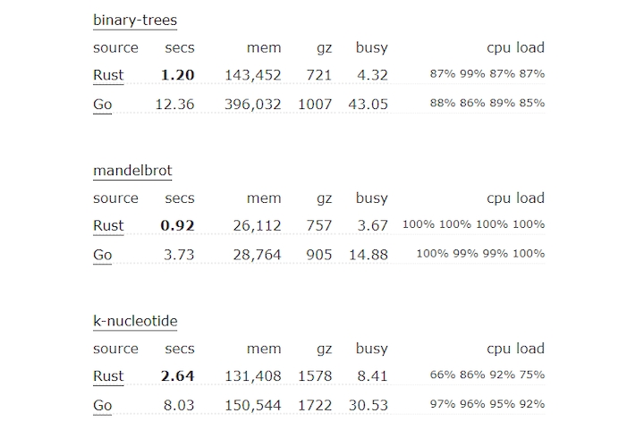

- 原文地址：https://medium.com/codex/when-to-use-rust-and-when-to-use-go-590bcbb49bec
- 译者：[tt](https://github.com/1-st)

首先, Go 和 Rust 之间有明显的区别。 Go 更加注重构建可扩展的 Web API 和微服务，尤其是有 goroutine 的助力。 虽然 Rust 作为后者也可以做这些事情，但是开发体验要差许多。


Rust 非常适合处理大量数据和其他 CPU 密集型操作，例如执行算法。这是 Rust 相比于 Go 的最大优势。要求高性能的项目通常更适合 Rust 。

在本教程中，我们将对 Go 和 Rust 进行比对，评估各自的并发性，内存管理和开发体验。我们还会对这些事物做出综述，来帮助你快速为项目做技术选型。

如果这吸引了你，我们开始深入讲解!

## 性能
Go 最初是由 Google 的工程师设计的，于 2009 年公布。它作为 C++ 的替代方案而产生，易于学习和编码，并且经过优化可在多核 CPU 上运行。

自那之后，Go 语言变得非常适合希望利用语言内置并发性的开发者。该语言提供的 goroutine 可以使你像子进程一样运行函数。

Go 的一大优势是您可以轻松使用 goroutine。只需将 go 关键字写到到函数前即可使其作为子进程运行。 Go 的并发模型使您可以在多个 CPU 内核之间平衡工作负载，使其成为一种非常高效的语言。
```go
package main
import (
	"fmt"
	"time"
)
func f(from string) {
	for i := 0; i < 3; i++ {
		fmt.Println(from, ":", i)
	}
}
func main() {
	f("direct")
	go f("goroutine")
	time.Sleep(time.Second)
	fmt.Println("done")
}
```

尽管有多核 CPU 支持，Rust 仍然可以跑赢 Go。 Rust 在执行算法和资源密集型操作方面效率更高。基准测试通过各种算法将 Rust 和 Go 做比较，例如二叉树。对于所有测试算法，Rust 至少快 30％；在二叉树计算的情况下，最高可达 1,000％。
Bitbucket的一项研究表明，Rust与C ++的性能相似。


*(来源: 基准测试)*

## 并发性
如上所述，Go 支持并发。例如，假设您正在运行一个处理 API 请求的网络服务器。您可以使用 Go 的 goroutine 将每个请求作为子进程运行，将任务分布到所有可用的 CPU 核心来最大化效率。

Goroutine 是 Go 内置函数的一部分，而 Rust 仅支持使用 async/await 来实现并发。因此，当涉及到并发时，Go 的开发体验更好。但是，Rust 在内存安全性方面要好得多。

这是一个简化的 Rust 线程示例：

```rust
use std::thread;
use std::time::Duration;
fn main() {
    // 1. create a new thread
    for i in 1..10 {
        thread::spawn(|| {
            println!("thread: number {}!", i);
            thread::sleep(Duration::from_millis(100));
        });
    }
    println!("hi from the main thread!");
}
```
并发一直是开发人员的棘手问题。在不损害开发体验的前提下，确保内存安全的并发并不是一件容易的事。但是，正是这种对安全的极端关注导致了可证明是正确的并发模型的产生。 Rust 尝试使用所有权概念来防止未经授权的资源访问，以防止出现内存安全错误。

Rust提供了四种不同的并发范式，以帮助您避免常见的内存安全陷阱。我们将仔细研究两个常见的范例： 通道(Channel)和 锁(Lock)。

## 通道
通道有助于将消息从一个线程传输到另一个线程。虽然 Go 也存在这种概念，但 Rust 允许您将指针从一个线程转移到另一个线程，以避免资源竞争。通过传递指针，Rust 可以为通道强制执行线程隔离。同样，Rust 的并发模型也表现出对内存安全的“痴迷”。

## 锁
仅在持有锁时才能访问数据。 Rust 依赖于锁定数据的原则而不是 cod(condition机制)，而 cod 经常在诸如 Java 之类的编程语言中找到。

有关所有权和所有并发范例的更多详细信息，请查看 “Fearless Concurrency with Rust”(无畏并发)。

## 内存安全
早期的所有权概念是 Rust 的主要卖点之一。Rust 具有类型安全性，这一点对于用于将内存安全并发提升到一个新的水平很重要

根据 Bitbucket 博客的说法，“ Rust 非常严格且繁琐的编译器会检查您使用的每个变量以及您引用的每个内存地址。它避免了可能的数据竞争情况，并通知您关于未定义行为的信息。”

这意味着，由于 Rust 对内存安全性的极度痴迷，您将不会出现缓冲区溢出或竞争条件。但是，这也有其缺点。例如，您在编写代码时必须非常了解内存分配原则。始终保持内存安全编程并不容易。

## 开发体验
首先，让我们看一下这两种语言的学习曲线。 Go 的设计考虑了简单性。开发人员经常将其称为“无聊的”语言，也就是说，其有限的内置功能使 Go 易于使用。

此外，Go 作为一种 C++ 的简单替代方法，隐藏了诸如内存安全性和内存分配之类的问题。 Rust 走了另一条路，强迫您考虑诸如内存安全性的概念。所有权的概念和可以传递指针的能力使 Rust 变得不那么吸引人学习。当您不断考虑内存安全性时，您的工作效率就会降低，并且您的代码注定会变得更加复杂。

与 Go 相比，Rust 的学习曲线非常陡峭。值得一提的是，与 Python 和 JavaScript 等动态语言相比，Go 的学习曲线更为陡峭。

## 什么时候使用 Go
Go 在各种场景中都能很好地工作，使其成为创建 Web API 的 Node.js 的绝佳替代品。正如 Loris Cro 指出的那样，“ Go 的并发模型非常适合必须处理多个独立请求的服务器端应用程序”。这正是 Go 提供 goroutine 的原因。

除此之外，Go 内置了对 HTTP Web 协议的支持。您可以使用内置的 HTTP 支持快速实现一个小型 API，并将其作为微服务运行。因此，Go 非常适合微服务架构，可满足 API 开发人员的需求。

简而言之，如果您重视开发速度并且更喜欢简单的语法而不是极致的性能，那么 Go 是一个很好的选择。最重要的是，Go 提供了更好的代码可读性，更符合大型开发团队的准则。

这时候使用 Go:
* 你关注简洁性和可读性
* 你需要简单的语法来快速编写代码
* 你想要使用一种更加灵活的语言来做 web 开发

## 什么时候使用 Rust
当性能至关重要时，例如处理大量数据时，Rust 是一个不错的选择。此外，Rust 在线程行为和资源跨线程共享方面为您提供了细粒度控制的可能。
另一方面，Rust 具有陡峭的学习曲线，并且由于内存安全性的额外复杂性而减慢了开发速度。这不一定是不利的。 Rust 还让编译器检查每个数据指针，来保证您不会遇到内存安全错误。对于复杂的系统，此保证会派上用场。

这时候使用 Rust:
* 你关注性能
* 你需要对于线程的细粒度控制
* 你认为内存安全性比简洁性更重要

## Go vs. Rust: 我的肺腑之言
让我们首先强调相似之处。 Go 和 Rust 都是开源的，旨在支持微服务架构和并行计算环境。两者都通过并发优化了可用 CPU 内核的利用率。

说到底，哪种语言是最好的？

有很多方法可以解决这个问题。我建议您考虑要构建的应用程序种类。 Go 可以很好地利用内置的并发特性来创建微服务架构下的 Web 应用程序和 API。

您也可以使用 Rust 来开发 Web API，但这不是在设计时考虑到的。 Rust 专注于内存安全性会增加复杂性和开发时间，尤其是对于相当简单的 Web API 而言。但是，对代码的大量控制使您可以编写更优化，内存效率更高且性能更高的代码。

简而言之，Go 与 Rust 的争论实际上是一个简单与安全的问题。