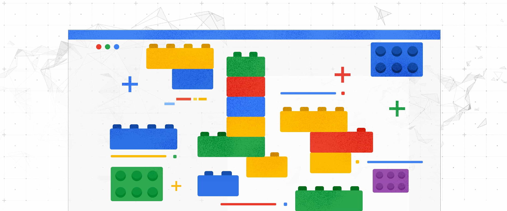

# **Go is powering enterprise developers: Developer survey results**

* 原文地址：https://cloud.google.com/blog/topics/developers-practitioners/go-powering-enterprise-developers-developer-survey-results
* 原文作者：`Matt Pearring, Alice Merrick`
* 本文永久链接：https://github.com/gocn/translator/blob/master/2021/w18_Go_is_powering_enterprise_developers.md
- 译者：[Fivezh](https:/github.com/fivezh)
- 校对：

Each year the Go team at Google conducts a developer survey, to capture feedback from the Go community, and identify trends that shape our work. Go is one of the most popular languages used on Google Cloud, and this year, we expanded the survey to include more specific questions around Cloud development. We’re sharing some of our results here (with the full report available in our [separate post](https://blog.golang.org/survey2020-results)), to provide some insight into feedback that informs our commitment to ensuring the experience of building with Go on Google Cloud is best-in-class.

### Go has become a critical tool in the enterprise

Go is cementing its role as a critical tool in the enterprise, boosting developer productivity and serving as a key component to business success. When it comes to workloads, Go is heavily used in deployment on the Cloud. Among our survey respondents, the most common use case of Go was to build API/RPC services (74%), followed closely by command-line applications (65%), both of which are tools used commonly by cloud developers. 

When working on their projects, Go users continue to feel incredibly satisfied and productive, especially in the enterprise, showcasing Go’s suitability in that environment. With 92% of enterprise users feeling “somewhat” or “very” satisfied, and satisfaction for “using cloud services” with Go up 14%, we’re happy to hear that Go remains pleasant to work with. Go’s effect on productivity is also quite positive, with 81% of enterprise users feeling “very” or “extremely” productive. 

We also heard that two-thirds (66%) of Go developers feel that Go is critical to their company’s success. It’s amazing to hear how users and teams continue to lean on Go for it’s reliability, simplicity, and speed.

### Adoption of Go is getting easier 

Go’s adoption in the workplace is growing, and it’s becoming easier for teams to become productive with Go. On the adoption front, working on an “existing project written in another language” and IT leadership “[preferring] another language” both continued to decrease as reasons why teams don’t use Go more often. And following up on the productivity results discussed earlier, three quarters of enterprise users become productive with Go in less than 3 months, with 93% reaching productivity within a year. 

Results like these show that getting started with Go remains quick and easy, though getting larger teams to move to Go or use it when faced with existing language preferences, while declining as challenges, is still a point of friction. We’ll continue to address these issues by improving our documentation, and additional work on tooling and support. 

Part of the work we’ve already done includes taking over maintenance of the VS Code Go Plugin and releasing [several improvements](https://blog.golang.org/gopls-vscode-go), in addition to constant improvements to our package discovery site, [pkg.go.dev](http://pkg.go.dev/). For example, this year's survey showed that 91% of pkg.go.dev users are able to quickly find Go packages and libraries, compared to 82% for those who don’t use the site. We’re committed to further improving the process of adopting Go, and we believe these results underscore that. 

### Bringing continuous improvements to Go

The Go team at Google is committed to continually improving the experience of developing with Go. In this year’s survey we heard that a large portion (~17%) of Go users feel that Go is missing critical features, and among that set 88% feel that not having generics in Go prevents them from using it more. 

The good news is that generics is coming to Go! Earlier this year we shared our [proposal for adding generics to Go](https://blog.golang.org/generics-proposal) and just recently the proposal was [accepted](https://github.com/golang/go/issues/43651), marking a huge step towards bringing generics to the language. Adding a feature like generics is only possible with constant feedback and collaboration from the community (which is part of what makes being a Go developer so great).

Bringing continuous improvements to Go, like feature specific work, or more generally with our bi-annual releases, requires trust from the Go community, and that trust is something we continue to build. The Go community is growing, with developers using Go for more types of projects, and teams of larger scope using Go to tackle their biggest challenges. 

With an increasingly diverse community it’s important to ensure we’re helping all users succeed. Fortunately, the trust our users put in us is strong, with user confidence in Go leadership and feeling welcome in the Go community remaining stable over the last few years. This year in particular, we saw a significant increase (up 6%) in users agreeing that Go “leadership understands [their] needs” showcasing that the work we put in is helping to address more users across the ecosystem. We take this trust seriously and will continue to engage with our users to improve the experience of using Go.

### There’s more to the story, and more ways to get involved

We discussed a few of the key results from this year’s Go Developer Survey, particularly as it relates to cloud development, and our commitment to improving Go. There are many more details that you can view in [the complete report](https://blog.golang.org/survey2020-results). 

Additionally, we’ll continue to collect feedback from the Go community, through an increased cadence of surveys, and smaller group discussions, particularly as it relates to enterprise development. Stay tuned by following [Go on twitter](https://twitter.com/golang), and by visiting [Go.dev](https://go.dev/), to learn how you can get involved.

### RELATED ARTICLE

[Get Go-ing with Cloud Functions: Go 1.11 is now a supported language](https://cloud.google.com/blog/products/application-development/cloud-functions-go-1-11-is-now-a-supported-language)