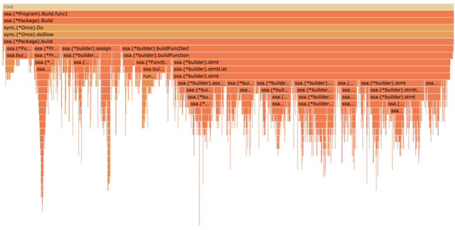
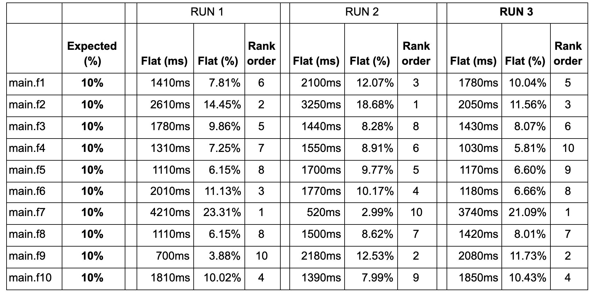
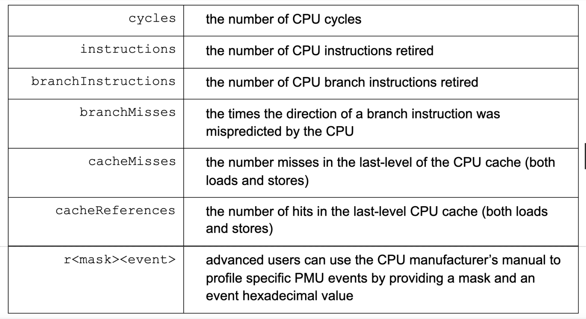
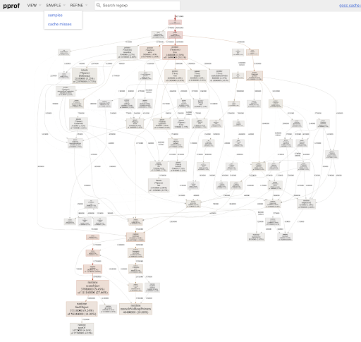
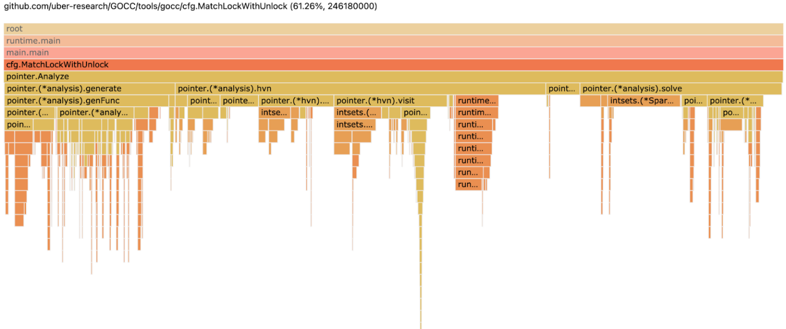

# **pprof++: A Go Profiler with Hardware Performance Monitoring**

* 原文地址：https://eng.uber.com/pprof-go-profiler/
* 原文作者：[Milind Chabbi](https://eng.uber.com/author/milind-chabbi/)
* 本文永久链接：https://github.com/gocn/translator/blob/master/2021/w20_pprof_go_profiler.md
- 译者：[tt](https:/github.com/1-st)
- 校对：[]()



## Motivation for a Better Go Profiler 

Golang is the lifeblood of thousands of Uber’s back-end services, running on millions of CPU cores. Understanding our CPU bottlenecks is critical, both for reducing service latencies and also for making our compute fleet efficient. The scale at which Uber operates demands in-depth insights into codes and microarchitectural implications.

While the built-in Go profiler is better than having no profiler compared with several other languages, the de facto CPU profiler in Go has serious limitations on Linux-based systems (and likely on other OSes as well) and lacks many [1, 2, 3, 4] of the details needed for fully understanding CPU bottlenecks. 

With these concerns in mind, we set out to build a custom Go profiler that is better suited to our needs and the scale of Uber’s business operations. Specifically, we enhance Go’s default pprof profiler by integrating rich hardware performance-monitoring features into it. This advancement offers the following key benefits:

1. The ability to obtain more accurate and precise go program profiles
2. The ability to monitor various CPU events such as cache misses, inter-socket (NUMA) traffic, CPU branch mispredictions, to name a few
3. The ability to monitor go programs with a very high sampling frequency — up to 10s of microseconds

## Background 

Profiling is one of Golang’s built-in features. The Go profiler covers aspects such as CPU time, memory allocation, etc. This article pertains to the most common and familiar form of profiling — the CPU profiling. There are 3 well-known approaches to obtaining CPU profiles from a Go program:

1. **Getting CPU profiles over an exposed http port** 

    First, expose profiling endpoints on a designated port by including the following code snippet in the Go program:  

    ```golang 
    go func() {log.Println(http.ListenAndServe("localhost:6060", nil))}() 
    ``` 

    Then, fetch the profiles from the profiling endpoint from the running Go program; for example, the following command contains 5 seconds of CPU profiles and stores it in the timer.prof file. 

    ```shell
    $curl -o timer.prof server200:6060/debug/pprof/profile?seconds=5
    ``` 

    At Uber, we rely extensively on our ability to fetch profiles from thousands of our production microservices, and we have an elaborate set of downstream tools to post-process them. 
2. **Getting CPU profiles from Go benchmarking**
    The Go testing framework allows for benchmarking a program and then profiling the benchmark by passing the extra -cpuprofile flag to collect the CPU profiles.
    ```shell
    $go test -bench BenchmarkXYZ -cpuprofile cpuprof.out
    ```

3. **Getting CPU profiles from code instrumentation**
    One can insert start/stop profiling APIs around the code region of interest and provide an io.writer to flush the resulting profiles to a file, as shown below: 
    ```golang
    f, err := os.Create("cpuprof.prof")
    defer f.Close()
    pprof.StartCPUProfile(f)
      MyCodeToProfile()
    pprof.StopCPUProfile()

    ```

    All three interfaces produce a pprof protocol buffer file, which can be viewed with the go tool pprof <profile file> command line or other downstream tools. A Go CPU profile includes time attribution to call stack samples. They can be visualized with call-graphs and flame-graphs.

## Accuracy and Precision 

Accuracy and precision are fundamental properties of a good measurement tool. 

A profiling datum is said to be accurate if it is close to the ground truth. For example, if API_A() consumes 25% of the total execution time and a profiler attributes it 24% of the total execution time, the measurement has 96% accuracy.

Profiling data are said to be precise if there is low variability among multiple measurements. Precision of a set of measurements of the same variable is often expressed either as min and max from the sample mean, or as standard error or coefficient of variation of the sample.

Unfortunately, the current pprof CPU profiles meet neither of these two criteria. Inside the Go runtime, the CPU profiling employs operating system timers to periodically (~100 times a second) interrupt the execution. On each interrupt (aka a sample), it collects call stacks occurring at the same time. 

## Inaccuracy and Its Causes

Inaccuracy of profiles arises from 2 sources: sampling frequency and sampling bias.

**Sampling frequency**: The accuracy of a sampling-based profiler is loosely related to [Nyquist Sampling Theorem](https://en.wikipedia.org/wiki/Nyquist%E2%80%93Shannon_sampling_theorem). In order to faithfully recover the input signal, the sampling frequency should be greater than twice the highest frequency contained in the signal. If a microservice takes, say, 10 milliseconds, to handle a request, we should sample at least every 5 milliseconds to get some sense of what happens within a request. But, the OS timers cannot go below one sample per 10ms. In fact, for accurate profiles at function level, we need samples at microseconds granularity.

[A larger number of samples](https://en.wikipedia.org/wiki/Law_of_large_numbers) may make profiles closer to reality and one can obtain more samples by increasing the length of a measurement window. Linearly scaling the measurement time to collect more samples is impractical if orders of magnitude more samples are necessary to correct the small samples size issue. Hence, there is a dire need to collect more samples within a measurement window and obtain fine-grained samples of sub-millisecond executions.

**Sampling bias**: A larger sample size alone does not improve accuracy if the samples are biased. OS timer (itimer) samples in Linux are biased because a timer interrupt from one OS thread, say T1 may be handled by an arbitrary (not to be confused with uniformly random) thread, say T2. This means, T2 will handle the interrupt and incorrectly attribute the sample to its call stack, which results in biased samples. If more timer interrupts are handled by T2 compared to T1, a systematic sampling bias will occur, which leads to inaccurate profiles.

## Imprecision and Its Causes 

Two major causes lead to most measurement imprecision: sample size and measurement skid.

**Sample size**: Fewer number of samples directly contributes to a large standard error. The low resolution of OS timers is responsible for fewer samples in a measurement window, which results in a lower precision of pprof profiles. Conversely, a higher resolution of samples will improve precision.

**Measurement skid**: The second source of measurement error is the random error inherent in any given measurement apparatus. An OS timer apparatus configured to expire after N milliseconds is only guaranteed to generate an interrupt some time after N milliseconds—not precisely at N milliseconds. This randomness introduces a large “skid” in measurement. Assume a periodic timer set to fire every 10ms. Assume it has 1ms left before its expiry when the OS scheduler with a 4ms resolution inspects it. This means the timer will fire 4ms later, which is 3ms after the scheduled expiry time. This results in up to 30% imprecision for a 10ms periodic timer. Although random error may not be entirely eliminated, a superior measurement apparatus reduces the effects of random error.

## Demonstration 
Consider the Go program [goroutine.go](https://github.com/chabbimilind/GoPprofDemo/blob/master/goroutine.go), which has 10 exactly similar goroutines main.f1-main.f10 where each function takes exactly the same amount of CPU time (i.e., 10% of the overall execution). Table 1 summarizes the results of using the default pprof cpu profile for this program, running on a 12-core Intel Skylake server-class machine with a Linux OS: 

 

The measurements were taken 3 times under the same configuration represented by the RUN 1, RUN 2, and RUN 3 header columns in Table 1. The Expected (%) column shows the expected relative time in each routine. The Flat (ms) columns show the absolute millisecond measurement attributed to each of the 10 routines, and the Flat (%) columns show the relative time in a routine with respect to the total execution time in each run. The Rank order columns assign ranks in the descending order of execution time for each function for each run.

Consider the data in RUN 1. main.f1-main.f10 have a wide variance in the time attributed to them, whereas we expected each one of them to be 10% of the total time. There is up to a 6x difference in the time attributed to the routine with the highest amount of attribution (main.f7 with 4210ms, 23.31%) and the routine with the lowest amount of attribution (main.f9 with 700ms, 3.88%). This demonstrates the poor accuracy (deviation from the ground truth) of pprof timer-based profiles. 

Now focus on the 3 runs RUN 1, RUN2, and RUN 3 together. The time attributed to any routine widely varies from one run to another. The rank order of the routines changes significantly from run to run. In RUN 1, main.f7 is shown to run for 4210ms with the rank order of 1, whereas in RUN 2, it is shown to run for only 520ms with the rank order 10. The expectation is that the measurements remain the same from run to run. There is a 71% coefficient of variance among the 3 runs of the main.f1 routine and the average coefficient of variance across all functions is 28%. This demonstrates imprecision of pprof timer-based profiles. Increasing the running time of this program by 10x or even 100x does not correct this profiling error.

Additional details appear in a Golang proposal [here](https://go.googlesource.com/proposal/+/refs/changes/08/219508/2/design/36821-perf-counter-pprof.md).

## Going Beyond Code Hotspots 

The second aspect of a profiler is making it offer more details than mere hotspots to aid developers in taking corrective actions. All profiles show hotspots, but hotspots are, at best, only symptoms, and don’t fully reflect underlying problems. For example, if a profiler shows that the program spends 90% time in a matrix-matrix multiplication, it does not tell whether it is good or bad; the matrix multiplication may be highly optimized already! However, if a profiler can pinpoint that 50% of the data accessed during a matrix-matrix multiplication were fetched from a remote DRAM of a NUMA system it was running on, it immediately highlights data locality problems in the program, and hence also opportunities for optimization. Such details are hard to come by in basic profilers, the default Go profiler included.

## Solution with Hardware Performance Counters 

To address these concerns, we developed pprof++, which enhances the default Go CPU profiler to use hardware performance monitoring features. 

1. **Improved accuracy and precision**: Modern commodity CPUs are equipped with hardware performance monitoring units (PMUs). One can configure hardware performance counters to very fine measurement granularity, which enhances profiling accuracy. Furthermore, the advancements in PMUs offer features that record the CPU state at the time of an interrupt, which allows for reconstructing the precise state of a program, resulting in higher precision. Finally, the interrupts from hardware PMUs can be configured to be delivered to a specific thread in question, which avoids the problem of incorrect attribution, leading to higher profiling accuracy. 

2. **Insights into many kinds of CPU events for better diagnosis of performance problems**: Time alone is not sufficient when diagnosing complex performance problems. For example, if a lot of time is attributed to a data structure walk, it may not be obvious why. Hardware performance monitoring reveals a lot of internal functioning of the CPU and the memory subsystem that allows diagnosing the root causes of performance problems. For example, if a lot of new data is fetched before previously-accessed data is accessed again, it will be evicted from the CPU caches, and this becomes visible if one were to profile CPU cache misses. Similarly, if 2 adjacent data items are accessed by 2 independent threads, but they happen to reside on the same CPU cache-line, it results in the shared cache-line ping-ponging between the private caches of the 2 CPUs, commonly known as false-sharing, which can be diagnosed via a counter called as HITM in modern Intel CPUs. 
3. **High-frequency measurement**: Since PMUs can be configured with arbitrarily low sampling thresholds, one can monitor events at extremely high frequency (of the order of 10s or 100s of microseconds), which becomes necessary for latency-sensitive services where individual requests last for a only tens of milliseconds.  

PMUs are ubiquitous in modern CPUs, exposed by OSes such as Linux, and they can be programmatically controlled to deliver interrupts on accumulating a threshold number of events. For example, Intel publishes its [performance monitoring events](https://software.intel.com/content/dam/develop/public/us/en/documents/335279-performance-monitoring-events-guide.pdf) for each member of its processor family, and Linux exposes PMUs via perf_event subsystem. pprof++ makes changes to the Go runtime, subscribes to these hardware events, and gets periodic interrupts. This mechanism is often referred to as hardware event-based sampling. The choice of events makes the hardware performance monitoring rich and insightful. Like OS timer profiling, pprof++ performs call stack unwinding on each PMU interrupt and attributes events to call stack samples. This allows pprof++ profiles to highlight which functions and source lines cause different architectural bottlenecks, such as CPU cache misses.

For beginners, identifying which hardware performance event to monitor can be daunting; hence, we simplify the process and expose the following most common events. The events have a [preset](https://github.com/uber-dev/go/blob/release-branch.go1.16_pmu_pprof/src/runtime/pprof/pprof.go#L911) sampling period, which can be overridden. 





 

The output of pprof++ is the same, familiar pprof protocol buffer profile files, which can be viewed with a pprof tool as call-graphs (Figure 1) or flame-graphs (Figure 2), and also be fed to other downstream profile-processing workflows. If a profile is taken with PMU cycles event, the pprof call-graph and flame-graph will pinpoint and quantify which code regions (contexts) account for what amount of CPU cycles; if a profile is taken with PMU cacheMisses event, the pprof call-graph and flame-graph will pinpoint and quantify which code regions (contexts) account for what amount of CPU last-level cache misses, and so on. 

## Getting Started with pprof++ 

In order to take advantage of pprof++, recompile your Go program with our custom Go compiler, augmented with PMU profiling facilities; see the [availability](https://eng.uber.com/pprof-go-profiler/#CA) section below. 

The 3 techniques of profile collection described in the [background](https://eng.uber.com/pprof-go-profiler/#BG) section remain largely the same when using pprof++:

1. **Getting CPU profiles over an exposed port**

    As in case of pprof, include the same code snippet to expose profiling endpoints; no change is needed to the application code. A developer can now fetch the numerous varieties of profiles. We introduce 2 new parameters to the /debug/pprof/profile endpoint

    1.
        ```shell 
        event=<timer|cycles|instructions|cacheMisses|cacheReferences|branches|branchMisses|rHexValue>
        ```
    2.
        ```shell
        period=<Int64Value>
        ```
    Here are a few usage examples:

    a. Collect profiles using CPU cycles by sampling the call stack once in 5 million CPU cycles, and collect the profiles for 25 seconds.
    ```
    $ curl -o cycles.prof <host>:<port>/debug/pprof/profile?event=cycles\&period=5000000\&seconds=25 
    ```
    event=cycles indicates to the profiler to sample CPU cycles. The default is “timer” present in pprof. period=5000000 indicates to the  profiler to take one sample every 5M CPU cycles. This will result in about 500 samples per second on a 2.5GHz CPU. seconds=25 indicates to the profiler to measure the application for 25 seconds. The default is 30 seconds.

    b. Collect profiles using CPU-retired instructions event by sampling the call stack once in 1 million retired instructions and collect the profiles for 30 seconds (default).
    ```shell
    $ curl -o ins.prof <host>:<port>/debug/pprof/profile?event=instructions\&period=1000000
    ```
    c.Collect profiles using last-level cache misses by sampling the call stack once in 10K cache misses and collect the profiles for 30 seconds.
    ```shell
    $ curl -o cachemiss.prof <host>:<port>/debug/pprof/profile?event=cacheMisses\&period=10000
    ```
    d. Collect profiles to detect cache line contention due to true or false sharing between 2 cores on 2 different NUMA sockets. This is easily done with the [MEM_LOAD_L3_MISS_RETIRED.REMOTE_HITM](https://github.com/torvalds/linux/blob/master/tools/perf/pmu-events/arch/x86/skylakex/cache.json) event which has the mask0x4 and event code 0xD3 on a skylake architecture. Hence we set event=r04d3. Let’s take call stack samples for one in 10K such events.
    ```shell
    $ curl -o remote_hitm.prof <host>:<port>/debug/pprof/profile?event=r04d3\&period=10000
    ```
2. **Getting CPU profiles from Go benchmarking**

    We introduce 2 new parameters to the command line:

    1. 
        ```shell
        cpuevent=<timer|cycles|instructions|cacheMisses|cacheReferences|branches|branchMisses|rHexValue>
        ```
    2. 
        ```shell
        cpuperiod=<Int64Value>
        ```
    Here are a few usage examples:

    a. Collect profiles from CPU cycles counter on the BenchmarkXYZ by sampling one in every 1 million cycles and write the profiles to cycles.prof file.
    ```shell
    $go test -bench BenchmarkXYZ -cpuprofile cycles.prof -cpuprofileevent cycles -cpuprofileperiod 1000000
    ```
    b. Collect profiles of mispredicted branches in the BenchmarkXYZ by sampling one in every 10000 mispredicted branches and write the profiles to mispredbranch.prof.
    ```shell
    $go test -bench BenchmarkXYZ -cpuprofile mispredbranch.prof -cpuprofileevent branchMisses -cpuprofileperiod 100000
    ```
    c. Identify where the code incurs frequent misses in the first-level instruction cache of the CPU. This can be profiled on Intel Skylake machines with the event FRONTEND_RETIRED.L1I_MISS, which has the mask 0x1 and event code 0xc6. Let us sample this once in 10000 misses.
    ```shell
    $go test -bench BenchmarkXYZ -cpuprofile insL1miss.prof -cpuprofileevent r01c6 -cpuprofileperiod 10000
    ```
3. **Getting CPU profiles from code instrumentation**

    pprof++ introduces a new API to the runtime/pprof package. pprof.StartCPUProfileWithConfig(opt ProfilingOption, moreOpts…ProfilingOption) error, where ProfilingOption can be one of the following:

    ```golang
    func OSTimer(w io.Writer) ProfilingOption
    func CPUCycles(w io.Writer, period uint64) ProfilingOption
    func CPUInstructions(w io.Writer, period uint64) ProfilingOption
    func CPUCacheReferences(w io.Writer, period uint64) ProfilingOption
    func CPUCacheMisses(w io.Writer, period uint64) ProfilingOption
    func CPUBranchInstructions(w io.Writer, period uint64) ProfilingOption
    func CPUBranchMisses(w io.Writer, period uint64) ProfilingOption
    func CPURawEvent(w io.Writer, period uint64, hex uint64) ProfilingOption
    ```
    
    We can now use StartCPUProfileWithConfig/StopCPUProfile profiling APIs around the code region of interest.

    a.Profile a code region with CPU cycles event sampling once in 1 million CPU cycles.
    ```golang
    f, _ := os.Create("cpuprof.prof") 
    defer f.Close() 
    pprof.StartCPUProfileWithConfig(CPUCycles(f, 1000000))  
    MyCodeToProfile() 
    pprof.StopCPUProfile()
    ```
    We allow power users to simultaneously collect multiple events in a single run. This facility is protected under an environment variable GO_PPROF_ENABLE_MULTIPLE_CPU_PROFILES=<true|false>. Each event needs its own io.writer. The example below shows collecting 4 simultaneous profiles: CPU cycles (one in 10M), retired instructions (one in 1M), last-level cache misses (one in 10K), and retired load instructions that miss in the second-level TLB (one in 1K), which is available with event MEM_INST_RETIRED.STLB_MISS_LOADS, mask=0x11, event code=0xd0.
    ```golang
    cyc, _ := os.Create("cycprof.prof")
    defer cyc.Close()
    ins, _ := os.Create("insprof.prof")
    defer ins.Close()
    cache, _ := os.Create("cacheprof.prof")
    defer cache.Close()
    tlb, _ := os.Create("tlb.prof")
    defer brMiss.Close()
    pprof.StartCPUProfileWithConfig(CPUCycles(cyc, 1000000), CPUInstructions(ins, 1000000), CPUCacheMisses(cache, 10000), CPURawEvent("r11d0", 1000))
    MyCodeToProfile()
    pprof.StopCPUProfile()
    ```
## Video Demo 

The video below demonstrates the download, initial setup, and usage to get started with pprof++.

<video id="video" controls="" preload="none" poster="">
<source id="mp4" src="../static/images/w20_pprof_go_profiler/demoPprof.mp4" type="video/mp4">
</video>

## Conclusions and Availability 

Accurate and precise profiles that can give deeper and actionable insights into program executions are necessary for any programming language. Uber’s extensive use of Go for its microservices has led us to bring these capabilities into Golang’s Pprof profiler. While there exist many other third-party profiles with similar capabilities, the integration of PMU profiling within Go’s runtime offers seamless integration with myriad execution environments and downstream post-processing tools. 

We  have released a prototype of the current implementation of pprof++ on [GitHub](https://github.com/uber-research/go/tree/pmu_pprof_feb_12_2021_fe028e). We have made it available on top of the [Go 1.15.8](https://github.com/uber-research/go/commits/release-branch.go1.15_pmu_pprof) and  [Go 1.16](https://github.com/uber-research/go/commits/release-branch.go1.16_pmu_pprof) release branches.

pprof++ is currently available only on Linux OS.  For quick download, we have made x86_64 (aka AMD64) versions of the Go binaries available: 

1. [go1.15.8.linux-amd64.tar.gz](https://github.com/uber-research/go/releases/download/v1.15.8/go1.15.8.linux-amd64.tar.gz)
2. [go1.16.linux-amd64.tar.gz](https://github.com/uber-research/go/releases/download/v1.16/go1.16.linux-amd64.tar.gz) 

Several example programs using pprof++ are present under src/net/http/pprof/examples/ and src/runtime/pprof/examples/. 

## Acknowledgment 

[Pengfei Su](https://pengfei-su.github.io/), now assistant professor at UC Merced, developed the initial prototype while interning at Uber Programming System Group in the summer of 2019.