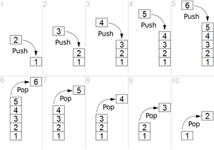

# Go 内存管理概述
- 原文地址：https://medium.com/safetycultureengineering/an-overview-of-memory-management-in-go-9a72ec7c76a8
- 原文作者： `Scott Gangemi`
- 本文永久链接： https://github.com/gocn/translator/blob/master/2021/w21_An_overview_of_memory_management_in_Go.md
- 译者：[haoheipi](https:/github.com/haoheipi)
- 校对：[cvley](https://github.com/cvley)

随着程序的运行，对象被写入内存。在一些特定时刻当它们不再被需要时，它们应该被移除。这个过程被称为 **内存管理** 。本文旨在给出内存管理的概述，然后深入研究在 Go 中如何使用垃圾收集器实现内存管理。Go 的内存管理近些年已经发生了很大变化，未来很可能还会发生更多变化。如果您正在阅读这篇文章，并且您使用的是比 1.16 更高的 Go 版本，那么这里的一些信息可能已经过时了。

## 手动内存管理

在像 C 这样的编程语言中，程序员会调用 `malloc` 或 `calloc` 之类的函数来将对象写入内存。这些函数返回一个指针，指向该对象在堆内存中的位置。当这个对象不再被需要时，程序员调用 `free` 函数来再释放以便再次使用这块内存。这种内存管理的方法被称为 **显式释放** 。它非常的强大，使程序员能够更好地控制正在使用的内存，从而允许某些类型优化变得更加容易，特别是在小内存环境下。但是，它也会导致两种类型的编程错误。

第一种是提前调用 `free` ，这会创建一个 **悬空指针** 。悬空指针是指不再指向内存中有效对象的指针。那么这会非常糟糕，因为程序期望一个指针指向的是已定义的值，而当这个悬空指针稍后被访问时，并不能保证在内存中该位置存在什么值。可能什么都没有，或者完全是其他值。第二种错误，内存根本无法释放。如果程序员忘记释放一个对象，他们可能会面临 **内存泄漏** 风险，因为内存会被越来越多的对象填满。如果内存不足，这可能导致程序变慢或崩溃。所以当不得不显式地管理内存时，可能会在程序中引入不可预测的错误。

## 自动内存管理 

这是像 Go 这样的语言提供了 **自动的动态内存管理** ，或者更简单地说，**垃圾收集** 的原因。具有垃圾收集功能的语言提供了如下好处:

- 安全性的提高
- 更好的跨操作系统移植性
- 需要编写的代码更少
- 代码的运行时校验
- 数组的边界检查

确实垃圾收集会带来性能开销，但并不像通常认为的那样多。所以折衷的方案是，程序员专注于他们程序的业务逻辑，并确保它符合目标，而不用担心管理内存。

一个正在运行的程序将对象存储在内存中的两个位置， _堆_ 和 _栈_ 。垃圾收集作用于堆上，而不是栈。栈是一个存储函数值的后进先出数据结构。从函数内部调用另一个函数，会将一个新的 _栈帧_ 放到栈上，它包含被调用函数的值等。当函数调用返回时，它的栈桢将会从栈上弹出。当在调试一个崩溃的程序时，您可能会熟悉栈这一结构。大多数语言的编译器会返回一个调用栈来帮助跟踪调试，它会显示在这一点之前被调用的函数。

> 
栈可以以一种后进先出的方式将值 “推” 到顶部，或者从顶部 “弹出” 。[图片来源 Wikipedia.](https://en.wikipedia.org/wiki/Stack_(abstract_data_type))

与栈相反，堆中包含的是在函数外部被引用的值。例如，在程序开始时定义的静态常量，或更复杂的对象，如 Go 结构体。当程序员定义一个放置在堆上的对象时，将分配所需的内存大小，并返回指向该对象的指针。堆是一种图结构，对象代表着节点，这些节点被代码或者其他对象所引用。随着程序的运行，堆将随着对象的添加而继续增长，除非对堆做清理。

>
堆从根节点开始，随着更多的对象被添加而增长。

## Go 中的垃圾收集

Go [更喜欢在栈上分配内存](https://groups.google.com/g/golang-nuts/c/KJiyv2mV2pU/m/wdBUH1mHCAAJ?pli=1)，所以大部分内存分配都会在这里结束。这也意味着 Go 中每个 goroutine 都有一个栈，如果可能的话，Go 将分配变量在这个栈上。Go 编译器通过执行 **逃逸分析** 来检查一个对象是否 ”逃逸” 出函数内部，从而尝试证明一个变量在函数之外不被需要。如果编译器可以确定一个变量的 [生命周期](https://www.memorymanagement.org/glossary/l.html#term-lifetime)，它将被分配在栈上。但是，如果变量的生存期不确定，它将会被分配到堆上。通常，如果一个 Go 程序有一个指向对象的指针，那么该对象就被存储在堆上。看看下面的示例代码：

```go
type myStruct struct {
  value int
}
var testStruct = myStruct{value: 0}
func addTwoNumbers(a int, b int) int {
  return a + b
}
func myFunction() {
  testVar1 := 123
  testVar2 := 456
  testStruct.value = addTwoNumbers(testVar1, testVar2)
}
func someOtherFunction() {
  // some other code
  myFunction()
  // some more code
}
```

出于本例的目的，让我们假设这是一个正在运行的程序的一部分，因为如果这是整个程序，那么 Go 编译器会通过将变量分配到栈来优化它。当程序运行时：

1. `testStruct` 是被定义和放置在堆中的一个可用内存块
2. `myFunction` 函数被调用执行时将会分配一个栈。`testVar1` 和 `testVar2` 都被存储在这个栈上。
3. 当调用 `addTwoNumbers` 时，一个新的栈帧被推到栈上，并带有函数的两个参数。
4. 当 `addTwoNumbers` 完成执行，它的结果返回给 `myFunction` 并且 `addTwoNumbers` 的栈帧从栈中弹出，因为它不再被需要。
5. 指向 `testStruct` 的指针被跟随到它堆上的位置，并且 `value` 字段被更新。
6. `myFunction` 退出，并清除为它创建的栈。`testStruct` 的值继续保持在堆上，直到垃圾收集发生。

`testStruct` 现在在堆上，也没有使用，Go 运行时也不知道是否仍然需要它。为此，Go 依赖于一个垃圾收集器。垃圾收集器有两个关键部分，一个 **更改器** 和一个 **收集器**。收集器执行垃圾收集逻辑并找到应该释放其内存的对象。更改器执行应用程序代码并将新对象分配给堆。它还在程序运行时更新堆上的现有对象，包括使不再需要的某些对象变为不可达。

>
由于更改器所做的更改，底部的对象已变为不可访问。它应该由垃圾收集器清理。

## Go 垃圾收集器的实现

Go 的垃圾收集器是一个 **非分代**，**并发**，**三色标记清除的垃圾收集器**。让我们把这几项分解。

[分代假设](https://www.memorymanagement.org/glossary/g.html#term-generational-hypothesis) 是寿命短的对象（如临时变量）最常被回收。因此，分代垃圾收集器主要关注最近分配的对象。然而如前所述，编译器优化允许 Go 编译器将具有已知生命周期的对象分配在栈上。[这意味着堆上的对象更少，因此垃圾收集的对象更少](https://groups.google.com/g/golang-nuts/c/KJiyv2mV2pU/m/wdBUH1mHCAAJ)。这也意味着在 Go 中不需要分代垃圾收集器。因此，Go 使用了一个非分代的垃圾收集器。[并发意味着收集器与更改器线程同时运行](https://github.com/golang/go/blob/master/src/runtime/mgc.go#L7)。因此，Go 使用的是一个非分代、并发的垃圾收集器。标记清除是垃圾收集器的工作类型，三色是用于实现这一功能的算法。

一个标记清除垃圾收集器有两个阶段，不出所料地命名为 **标记** 和 **清除** 。在标记阶段，收集器遍历堆并标记不再需要的对象。后续扫描阶段将删除这些对象。标记和清除是一种间接算法，因为它标记活动对象，并移除其他所有东西。

>
可视化的标记清除收集器过程，[来源于这里](https://spin.atomicobject.com/2014/09/03/visualizing-garbage-collection-algorithms/)。如果你感兴趣的话，还可以看到其他类型的垃圾收集器。

[Go 用几个步骤实现了这一点](https://github.com/golang/go/blob/master/src/runtime/mgc.go#L24)：

Go 让所有的 goroutines 到达一个垃圾收集安全点，并使用一个名为 **stop the world** 的过程。这将暂时停止程序的运行，并打开一个 **写屏障** 以维护堆上的数据完整性。通过允许 goroutine 和收集器同时运行，从而实现了并发性。

一旦所有的 goroutine 都打开了写障碍，Go 运行 **starts the world** 并让工作线程开始执行垃圾收集工作。

标记是通过使用一个 **三色算法** 实现的。当标记开始时，除了根对象是灰色的，所有对象都是白色的。根是所有其他堆对象的来源，并作为运行程序的一部分实例化。垃圾收集器首先扫描栈、全局变量和堆指针，以了解什么对象正在使用。当扫描一个栈时，工作线程将停止 goroutine ，并通过从根向下遍历将所有发现的对象标记为灰色。然后继续执行 goroutine 。

然后，灰色的对象将入队变成黑色，这表明它们仍在使用中。一旦所有的灰色对象被标为黑色，收集器将会再一次 **stop the world** 并且清理所有不再被需要的白色节点对象。程序现在可以继续运行，直到它需要再次清理更多内存。

>
[这张来自维基百科的图表让上述更容易理解](https://en.wikipedia.org/wiki/Tracing_garbage_collection#Tri-color_marking)。颜色有点混乱，但白色物体是浅灰色，灰色物体是黄色，黑色物体是蓝色。

一旦程序按照使用的内存比例分配了额外的内存，这个进程将再次启动。 `GOGC` 环境变量决定了这一比例，默认值为 100 。[Go 的源代码描述如下:](https://github.com/golang/go/blob/master/src/runtime/mgc.go#L112)

> *如果 GOGC=100 并且我们正在使用 4M 内存，我们将在到达 8M 时再次进行 GC（这个标记在 next_gc 变量中被跟踪)。这使 GC 成本与分配成本成线性比例。调整 GOGC 只是改变线性常数（还有额外内存的使用量）。*

Go 的垃圾收集器通过将内存管理抽象到 Go 运行时来提高效率，这也是使 Go 具有如此优秀性能的原因之一。Go 内置的工具允许您优化程序中垃圾收集的触发行为，如果您感兴趣，可以对此进行研究。至此，我希望您了解到了更多关于垃圾收集的工作原理和在 Go 中如何实现垃圾收集的知识。

## 参考

- [Garbage Collection in Go: Part 1](https://www.ardanlabs.com/blog/2018/12/garbage-collection-in-go-part1-semantics.html)

- [Getting to Go: The Journey of Go’s Garbage Collector](https://blog.golang.org/ismmkeynote)

- [Go: How Does the Garbage Collector Mark the Memory?](https://medium.com/a-journey-with-go/go-how-does-the-garbage-collector-mark-the-memory-72cfc12c6976)

- [Golang: Cost of using the heap](https://medium.com/invalid-memory/golang-cost-of-using-the-heap-e70363469754)

- [Golang FAQ](https://golang.org/doc/faq#stack_or_heap)

- [Google Groups discussion, comment by Ian Lance Taylor](https://groups.google.com/g/golang-nuts/c/KJiyv2mV2pU/m/wdBUH1mHCAAJ)

- [Implementing memory management with Golang’s garbage collector](https://hub.packtpub.com/implementing-memory-management-with-golang-garbage-collector/)

- [Memory Management Reference](https://www.memorymanagement.org/)

- [Stack (abstract data type)](https://en.wikipedia.org/wiki/Stack_(abstract_data_type))

- [The Garbage Collection Handbook](https://gchandbook.org/)

- [Tracing garbage collection: Tri-color marking](https://en.wikipedia.org/wiki/Tracing_garbage_collection#Tri-color_marking)