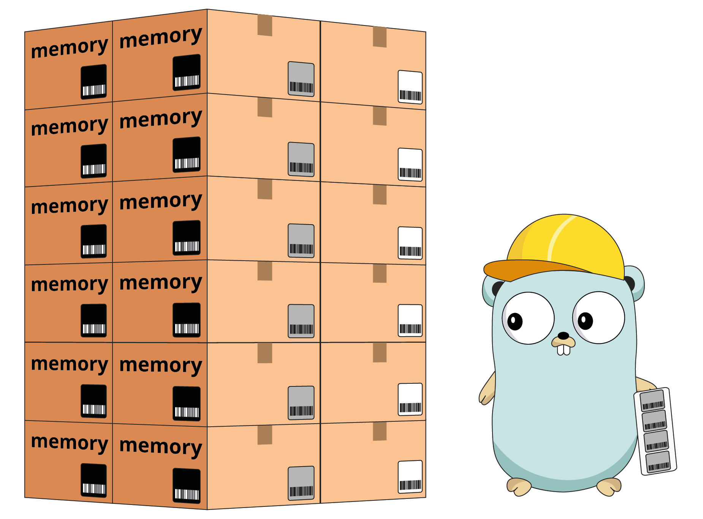
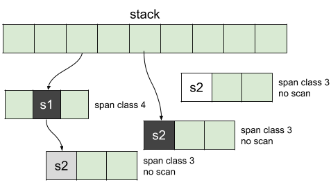

# Go: How Does the Garbage Collector Mark the Memory?

*原文地址：https://medium.com/a-journey-with-go/go-how-does-the-garbage-collector-mark-the-memory-72cfc12c6976
*原文作者：Vincent Blanchon
*本文永久链接：

- 译者：[cuua](https:/github.com/cuua)
- 校对：



This article is based on Go 1.13. The notions about memory management discussed here are explained in my article “Go: Memory Management and Allocation.”
The Go garbage collector is responsible for collecting the memory that is not in use anymore. The implemented algorithm is a concurrent tri-color mark and sweep collector. In this article, we will see in detail the marking phase, along with the usage of the different colors.
You can find more information about the different types of garbage collector in “Visualizing Garbage Collection Algorithms” by Ken Fox.
## Marking phase
This phase performs a scan of the memory to know which blocks are still in use by our code and which ones should be collected.
However, since the garbage collector can run concurrently with our Go program, it needs a way to detect potential changes in the memory while scanning. To tackle that potential issue, an algorithm of write barrier is implemented and will allow Go to track any pointer changes. The only condition to enable write barriers is to stop the program for a short time, also called “Stop the World”:


Go also starts, at the beginning of the process, a marking worker per processor that help with marking the memory.
Then, once the roots have been enqueued for processing, the marking phase can start traversing and coloring the memory.
Let’s now take an example with a simple program that will allow us to follow the steps done during the marking phase
```
Type struct1 struct {
	a, b int64
	c, d float64
	e *struct2
}

type struct2 struct {
	f, g int64
	h, i float64
}

func main() {
	s1 := allocStruct1()
	s2 := allocStruct2()

	func () {
		_ = allocStruct2()
	}()

	runtime.GC()

	fmt.Printf("s1 = %X, s2 = %X\n", &s1, &s2)
}

//go:noinline
func allocStruct1() *struct1 {
	return &struct1{
		e: allocStruct2(),
	}
}

//go:noinline
func allocStruct2() *struct2 {
	return &struct2{}
}
```

Since the struct subStruct does not contain any pointer, it is stored in a span dedicated to objects with no reference to other objects:


This makes the job of the garbage collector easier since it does not have to scan this span when marking the memory.
Once the allocations are done, our program forces the garbage collector to run for a cycle. Here is the workflow:


The garbage collector starts from the stack and follows pointers recursively to go through the memory. Spans that are marked as no scan stop the scanning. However, this process is not done by the same goroutine; each pointer is enqueued in a work pool. Then, the background mark workers seen previously dequeue works from this pool, scan the objects and then enqueue the pointers found in it:


## Coloring
The workers now need a way to track which memory has been scanned or not. The garbage collector uses a tri-color algorithm that works as follows:
all objects are considered white at the beginning
the root objects (stacks, heap, global variables) will be colored in grey
Once this primary step is done, the garbage collector will:
pic a grey object, color it as black
follow all the pointers from this object and color all referenced objects in grey
Then, it will repeat those two steps until there are no more objects to color. From this point, the objects are either black or white. The white set represents objects that are not referenced by any other object and ready to be collected.
Here is a representation of it using the previous example:


As a first state, all objects are considered white. Then, the objects are traversed and the ones reachable will turn grey. If an object is in a span marked as no scan, it can be painted in black since it does not need to be scanned:


Grey objects are now enqueued to be scanned and turn black:



The same thing happens for the objects enqueue until there are no more objects to process:


At the end of the process, black objects are the ones in-use in memory when white objects are the ones to be collected. As we can see, since the instance of struct2 has been created in an anonymous function and is not reachable from the stack, it stays white and can be cleaned.
The colors are internally implemented thanks to a bitmap attribute in each span called gcmarkBits that traces the scan with setting to 1 the corresponding bit:


As we can see, the black and the grey color works the same way. The difference in the process is that the grey color enqueues an object to be scanned when black objects end the chain.
The garbage finally stops the world, flushes the changes made on each write barrier to the work pool and performs the remaining marking.
You can find more details about the concurrent processes and the marking phase in the garbage collector in my article “Go: How Does the Garbage Collector Watch Your Application.”
## Runtime profiler
The tools provided by Go allow us to visualize all those steps and see the impact of the garbage collector in our programs. Running our code with the tracing enabled provides a big picture of the previous steps. Here are the traces:


The cycle of life of the marking worker can also be visualized in the tracer at the goroutine level. Here an example with the goroutine #33, which is waiting in background first before starting to mark the memory.


