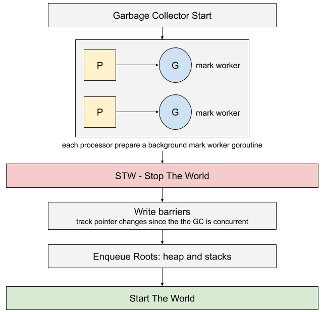
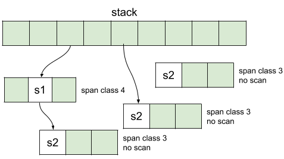
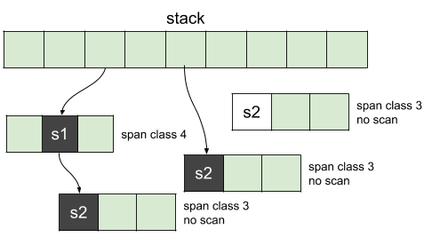

# Go: How Does the Garbage Collector Mark the Memory?

*原文地址：https://medium.com/a-journey-with-go/go-how-does-the-garbage-collector-mark-the-memory-72cfc12c6976
*原文作者：Vincent Blanchon
*本文永久链接：https://github.com/gocn/translator/blob/master/2021/w25_go_garbage_collector_mark_the_memory.md

- 译者：[cuua](https:/github.com/cuua)
- 校对：


本文基于Go 1.13。这里讨论的关于内存管理的概念在我的文章[Go:内存管理和分配](https://medium.com/a-journey-with-go/go-memory-management-and-allocation-a7396d430f44) 中有解释

Go垃圾收集器负责收集不再使用的内存。实现的算法是一个并行的三色标记扫描采集器。在本文中，我们将详细了解标记阶段，以及不同颜色的用法。

您可以在kenfox的[可视化垃圾收集算法](https://spin.atomicobject.com/2014/09/03/visualizing-garbage-collection-algorithms/) 中找到关于不同类型垃圾收集器的更多信息。

##标记阶段

此阶段执行内存扫描，以了解代码仍在使用哪些块，以及应该收集哪些块。

但是，由于垃圾收集器可以与我们的Go程序同时运行，因此它需要一种在扫描时检测内存中潜在变化的方法。为了解决这个潜在的问题，实现了一个写屏障算法，允许Go跟踪任何指针的变化。启用写屏障的唯一条件是短时间停止程序，也称为“STW”：



在进程开始时，Go还会为每个处理器启动一个标记辅助进程，以帮助标记内存。

然后，一旦根节点被排队等待处理，标记阶段就可以开始遍历内存并为其着色。

现在让我们以一个简单的程序为例，该程序允许我们遵循标记阶段所做的步骤

```
Type struct1 struct {
	a, b int64
	c, d float64
	e *struct2
}

type struct2 struct {
	f, g int64
	h, i float64
}

func main() {
	s1 := allocStruct1()
	s2 := allocStruct2()

	func () {
		_ = allocStruct2()
	}()

	runtime.GC()

	fmt.Printf("s1 = %X, s2 = %X\n", &s1, &s2)
}

//go:noinline
func allocStruct1() *struct1 {
	return &struct1{
		e: allocStruct2(),
	}
}

//go:noinline
func allocStruct2() *struct2 {
	return &struct2{}
}
```

由于struct subStruct不包含任何指针，因此它存储在一个专用于对象的范围中，而不引用其他对象：


这使得垃圾收集器的工作更容易，因为它在标记内存时不必扫描这个范围。

一旦分配完成，我们的程序就会强制垃圾收集器运行一个周期。以下是工作流程：


垃圾收集器从堆栈开始，递归地跟随指针遍历内存。标记为“无扫描”的范围将停止扫描。然而，这个过程不是由同一个goroutine
完成的；每个指针都在工作池中排队。然后 ，后台的标记线程发现之前的出列队列是来自该工作池，扫描对象，然后将在其中找到的指针加入队列：


## 着色
后台线程现在需要一种方法来跟踪哪些内存有没有被扫描。垃圾收集器使用三色算法，其工作原理如下：
 
 * 所有物体一开始都被认为是白色的
 
 * 根对象（堆栈、堆、全局变量）将以灰色显示
 
 完成此主要步骤后，垃圾收集器将：
 
 * 选择一个灰色的物体，把它涂成黑色
 
 * 遵循此对象的所有指针并将所有引用的对象涂成灰色
 
 然后，它将重复这两个步骤，直到没有更多的对象要着色。从这一点来看，对象不是黑色就是白色。白色集合表示未被任何其他对象引用且准备好回收的对象。
 
 下面是使用上一个示例对其进行的表示：



作为第一种状态，所有对象都被视为白色。然后，对象被遍历，可到达的对象将变为灰色。如果对象位于标记为“无扫描”的范围内，则可以将其绘制为黑色，因为不需要对其进行扫描：


灰色对象现在入队等待扫描并变黑：


在没有更多的对象要处理之前，入队的对象也会发生同样的情况：



在进程结束时，黑色对象是内存中正在使用的对象，而白色对象是要收集的对象。如我们所见，由于struct2的实例是在匿名函数中创建的，并且无法从堆栈访问，因此它保持为白色，可以清除。

由于每个跨度中有一个名为gcmarkBits的位图属性，颜色在内部实现，该属性跟踪扫描，并将相应的位设置为1：


正如我们所见，黑色和灰色的工作原理是一样的。这一过程的不同之处在于，当黑色物体结束扫描链时，灰色物体排队等待扫描。

垃圾回收器最终会stops the world，将每个写屏障上所做的更改刷新到工作池，并执行剩余的标记。

您可以在我的文章[Go:垃圾收集器如何监视您的应用程序](https://medium.com/a-journey-with-go/go-how-does-the-garbage-collector-watch-your-application-dbef99be2c35) 中找到有关并发进程和垃圾收集器中标记阶段的更多详细信息
## 运行时分析器
Go提供的工具允许我们可视化所有这些步骤，并在程序中查看垃圾收集器的影响。在启用跟踪的情况下运行我们的代码提供了前面步骤的一个大图。以下是traces：


标记线程的生命周期也可以在goroutine级别的tracer中可视化。下面是goroutine#33的示例，它在开始标记内存之前先在后台等待。


