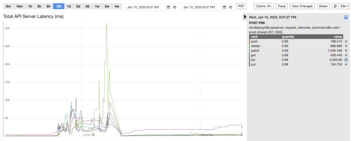
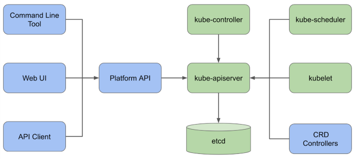
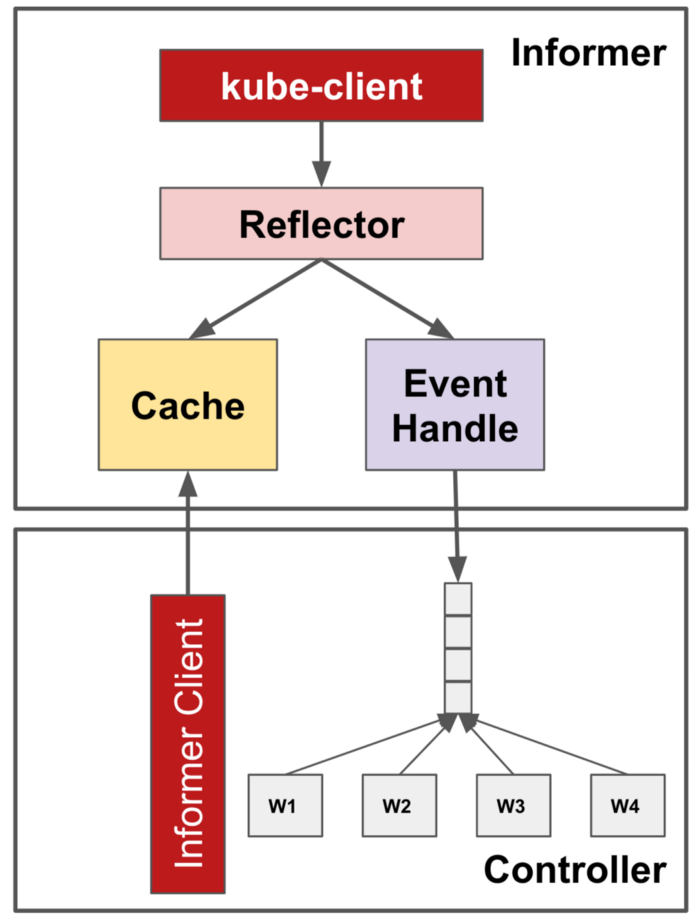
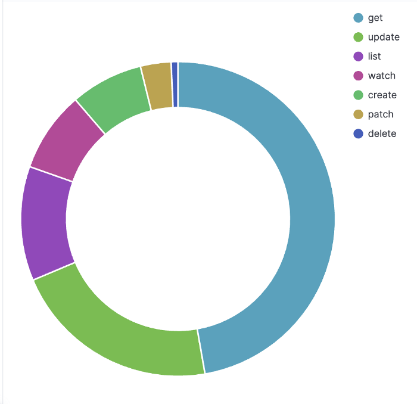
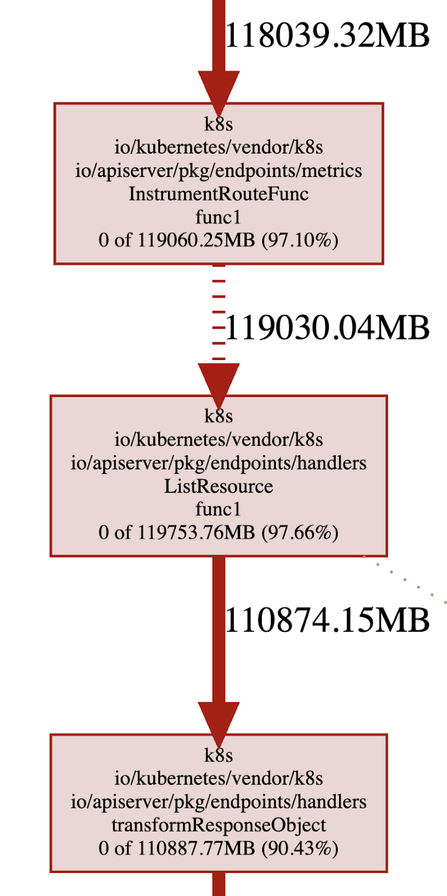

# Pinterest 如何保障扩展 Kubernetes

* 原文地址：https://medium.com/pinterest-engineering/scaling-kubernetes-with-assurance-at-pinterest-a23f821168da
* 原文作者：`pinterest-engineering`
* 本文永久链接：https://github.com/gocn/translator/blob/master/2021/w27_scaling_k8s_with_assurance_at_pinterest_introduction.md

- 译者：[咔叽咔叽](https:/github.com/watermeloooo)
- 校对：[cvley](https:/github.com/cvley), [Fivezh](https:/github.com/fivezh)

## 介绍

自从我们分享 [Kubernetes 在 Pinterest 的旅程](https://medium.com/pinterest-engineering/building-a-kubernetes-platform-at-pinterest-fb3d9571c948)以来，已经过去一年多了。从那时起，我们已经交付了许多功能以促进用户采用，确保可靠性和可扩展性，并建立了操作经验和最佳实践。

总的来说，Kubernetes 平台用户给出了积极的反馈。根据我们的用户调查，用户分享的前三大好处是，减少了管理计算资源的负担，更好的资源和故障隔离，以及更灵活的容量管理。

到 2020 年底，我们在 Kubernetes 集群中使用 **2500 多个节点**编排了 **35K+ pods**-- 支持更多的 Pinterest 的业务，而且增速仍然很快。

## 回首 2020

工作负载的种类和数量随着用户的增长而增长。这需要 Kubernetes 平台具有更强的可扩展性，以应对工作负载管理、pods 调度以及节点分配和释放带来的负载。随着 Kubernetes 平台部署越来越多的关键业务，对平台可靠性的期望自然会上升到一个新的水平。

整个平台的停机发生了。在 2020 年初，我们的一个群集经历了 Pod 创建的高峰 (大约是计划容量的 3 倍)，导致集群 autocalor 启动了 900 个节点来满足需求。[kube-apiserver](https://kubernetes.io/docs/concepts/overview/components/#kube-apiserver) 的延迟峰值和错误率不断增加，然后由于资源限制导致了 OOM-Killed。Kubelets 的未绑定重试导致 Kube-apiserver 负载增加了 7 倍。写入的突发流量导致 [ETCD](https://etcd.io/) 达到总数据大小限制，并开始拒绝所有写请求，平台在工作负载管理方面失去可用性。为了缓解这一事件，我们不得不在 etcd 执行操作，比如压缩版本、整理过多的空间以及禁用告警来恢复它。此外，我们不得不临时扩容托管 Kube-apiserver 和 etcd 的 Kubernetes 主节点，以减少资源限制的影响。

在 2020 年的下半年，有一个基础设施组件在 Kube-apiserver 集成中出现 bug，导致对 Kube-apiserver 的查询请求 (列出所有 Pod 和节点) 激增。这导致 Kubernetes 主节点资源使用达到高峰，Kube-apiserver 进入 OOM-Killed 状态。幸运的是，我们发现了有问题的组件，随后进行了回滚。但在事件发生期间，平台的性能出现了退化，包括工作负载执行的延迟和状态过期。

## 为扩容做准备

在整个过程中，我们不断反思平台治理、弹性和可操作性，特别是在事件发生并严重打击我们薄弱环节的时候。在有限工程资源的团队中，我们必须深入挖掘以找出根本原因，找到简单的解决方案，并根据收入与成本来权衡解决方案的优先级。我们处理复杂 Kubernetes 生态系统的策略是尽最大努力减少与社区的分歧，并回馈社区，但也不排除自己编写内部组件。

## 治理

### 强制资源配额

Kubernetes 已经提供了[资源配额](https://kubernetes.io/docs/concepts/policy/resource-quotas/)管理，以确保命名空间可以请求或占用大部分维度的资源：pods、CPU、内存等。正如我们之前提到的，单个命名空间中创建 pod 的激增会导致 Kube-apiserver 过载并级联失败。在每个命名空间中限制资源使用是确保稳定性的关键。

我们面临的一个挑战是，在每个命名空间中的 Pod 都需要显式地指定[资源请求与限制](https://kubernetes.io/docs/concepts/configuration/manage-resources-containers/#requests-and-limits)。在 Pinterest Kubernetes 平台中，不同命名空间的工作负载归不同项目的不同团队所有，平台用户通过 Pinterest CRD 配置工作负载。我们通过为 CRD 转换层中的所有 Pod 和容器添加默认资源请求和限制来实现这一点。此外，我们在 CRD 验证层中拒绝没有配置资源请求和限制定义的 Pod 。

我们克服的另一个挑战是简化团队和组织之间的配额管理。为了安全地启用强制资源配额，我们查看历史资源的使用情况，在峰值之上添加 20% 的盈余，并将其设置为每个项目的资源配额的初始值。我们创建了一个定时任务来监控配额使用情况，并在项目使用接近特定限制时向项目拥有团队发送警告。这鼓励项目拥有者更好地做好资源规划，并要求更改资源配额。资源配额更改将在人工审核通过后自动部署。

### 强制客户端访问

我们强制所有 KubeAPI 客户端遵循 Kubernetes 提供的最佳实践：

### 控制器框架

[控制器框架 controller framework](https://github.com/operator-framework) 为优化读操作提供了一个可共享的高速缓存，它利用了[Informer-Reflector-Cache architecture](https://godoc.org/k8s.io/client-go/informers)。**Informers** 监视来自 Kube-apiserver 的感兴趣的对象。**Reflector** 将对象更改反映到底层 **Cache**，并将关注的事件传播到事件处理程序。同一控制器中的多个组件可以从 **Informers** 注册 OnCreate、OnUpdate 和 OnDelete 事件的处理程序，并从 **Cache** 中获取对象，而不是直接从 Kube-apiserver 获取对象。因此，它减少了不必要和多余请求调用的机会。

### 限流

Kubernetes 的 API 客户端通常在不同的控制器之间共享，API 调用是由不同的线程进行的。Kubernetes 将其 API 客户端与支持可配置的 QPS 和突发的[令牌桶限流](https://en.wikipedia.org/wiki/Token_bucket)结合起来。超过阈值的 API 调用将被限制，这样单个控制器就不会阻塞 kube-apiserver 的带宽。

### 共享缓存

除了控制器框架附带的 Kube-apiserver 内置缓存之外，我们还在平台 API 中添加了另一个基于 informer 的写缓存层。这是为了防止不必要的读调用冲击 Kube-apiserver。服务端缓存重用还避免了应用程序代码中的胖客户端。

对于应用程序到 **Kube-apiserver**的访问，我们强制所有请求通过平台 API，以利用共享缓存并为访问控制和流量控制分配安全身份。对于**工作负载控制器**的 Kube-apiserver 访问，我们强制所有控制器都基于限流的控制框架实现。

## 弹性

### 强化 Kubelet

Kubernetes 的控制平面进入级联故障的一个关键原因是，传统的反射器实现在处理错误时有**无限**重试。这样的缺陷可能会被放大，特别是当 API 服务 OOM-Killed 时，这很容易造成整个集群的反射器同步。

为了解决这个问题，我们与社区密切合作，通过报告 [issues](https://github.com/kubernetes/kubernetes/issues/87794)，讨论解决方案，最后让 PR([1](https://github.com/kubernetes/kubernetes/pull/87829)，[2](https://github.com/kubernetes/kubernetes/pull/87795)) 被 review 和合并。这个想法是通过在 jitter reflector 的 ListWatch 重试逻辑中添加指数后退，这样 kubelet 和其他控制器就不会在 Kube-apiserver 过载和请求失败时重试 Kube-apiserver。一般而言，这种弹性改进是有用的，但我们发现，随着 Kubernetes 集群中节点和 Pod 数量的增加，它在 kubelet 端非常关键。

### 调整并发请求

我们管理的节点越多，工作负载的创建和销毁就越快，服务需要处理的 API 调用量就越大。我们首先根据估计的工作负载增加了可变和非可变操作的最大并发 API 调用设置。这两个设置将强制要求处理的 API 调用量不超过配置的数量，从而将 Kube-apiserver 的 CPU 和内存消耗保持在某个阈值。

在 Kubernetes 的 API 请求处理链中，每个请求开始都将经过一组过滤器。过滤器链是强制执行最大 API 调用量的位置。对于突发超过配置阈值的 API 调用，将向客户端返回 “请求太多” (429) 响应，以触发正确的重试。未来，我们计划在 [EventRateLimit features](https://kubernetes.io/docs/reference/access-authn-authz/admission-controllers/#eventratelimit) 上进行更多的研究，以提供更精细的准入控制，提供更好的服务质量。

### 缓存更多历史记录

watch 缓存是 Kube-apiserver 内部的一种机制，它将每种资源的过去事件缓存在环形缓冲区中，以便处理特定版本的监视调用。缓存越大，服务器中保留的事件就越多，并且在连接中断时更有可能无缝地向客户端提供事件流。考虑到这一事实，我们还改进了 Kube-apiserver 的目标 RAM 大小，最终在内部将其转换为基于启发式的监视内存容量，以服务于更健壮的事件流。Kube-apiserver 提供了[更详细的方法](https://kubernetes.io/docs/reference/command-line-tools-reference/kube-apiserver/)来配置细粒度的 watch 缓存大小，可以进一步利用它来满足特定的缓存需求。

## 可操作性

### 可观测性

为了减少事件检测和降低时间消耗，我们不断努力提高 Kubernetes 控制平面的可观测性。挑战在于平衡故障覆盖率和信号敏感度。对于现有的 Kubernetes 指标，我们会对重要指标进行选择监控和/或警报，以便更主动地识别问题。此外，我们利用 Kube-apiserver 工具覆盖更详细的区域，以便快速缩小根本原因。最后，我们调整警报统计数据和阈值，以减少噪音和错误警报。

在高层次上，我们通过查看 QPS 和并发请求、错误率以及请求延迟来监控 Kube-apiserver 负载。我们可以按资源类型、请求谓词和关联的服务帐户来细分流量。对于像列表这样昂贵的流量，我们还通过对象计数和字节大小来测量请求的有效负载，因为即使 QPS 很小，它们也很容易使 Kube-apiserver 过载。最后，我们将监控 etcd 事件的 QPS 和延迟处理计数，并以此作为服务器性能指标。

### 可调试性

为了更好地了解 Kubernetes 控制平面的性能和资源消耗。我们还使用 [boltdb](https://github.com/etcd-io/bbolt) 库和 [flamegraph](https://github.com/brendangregg/FlameGraph) 构建了 etcd 数据存储分析工具，以可视化数据存储。数据存储分析的结果为平台用户优化使用提供了可视性。

此外，我们启用了 Golang 的 [pprof](https://blog.golang.org/pprof) 工具并可视化堆内存占用。我们能够快速识别出最耗费资源的代码路径和请求模式，例如，在调用列表资源时转换响应对象。我们在 kube-apiserver OOM 的调查中发现的一个重要问题是 [kube-apiserver 使用的页内存](https://www.kernel.org/doc/Documentation/cgroup-v1/memory.txt) 被计入了 cgroup 的内存限制，匿名内存的使用可以窃取同一 cgroup 的页内存。因此，即使 Kube-apiserver 只有 20 GB 的堆内存使用量，整个 cgroup 也 会达到 200 GB 的内存使用量上限。虽然当前内核的默认设置是不主动回收分配的页以实现重用，但我们目前正在考虑基于 memory y.stat 文件设置监控，并强制 cgroup 在内存使用量接近上限时回收尽可能多的页内存。

## 总结

通过我们在治理、弹性和可操作性方面的努力，我们显著地减少了计算资源和控制平面带宽的使用激增，并确保整个平台的稳定性和性能。优化后的 Kube-apiserver QPS (大部分为 Read) 降低了 90% (如下图所示)，使得 Kube-apiserver 的使用更加稳定、高效和健壮。我们对 Kubernetes 内部的深入理解和获得的额外见解将使团队能够更好地进行系统操作和集群维护。

图 9：在优化之后 Kube-apiserver QPS 持续减少

以下是一些关键要点，希望可以帮助你解决 Kubernetes 的可扩展性和可靠性问题。

1.  诊断问题并找到问题的**根本原因**。在决定 "如何处理" 之前，要关注 "是什么"。解决问题的第一步是了解瓶颈是什么以及为什么。如果你找到了根本原因，就等于找到了一半的答案。
2.  研究**小的渐进式改进**是有必要的，而不是立即致力于激进的架构改变。这很重要，特别是当你有一个灵活的团队时。
3.  当你计划或优先考虑调查和修复时，要做出**数据驱动的**决定。正确的预测技术可以帮助更好的决定关注和优化什么。
4.  基础设施组件的设计应考虑到弹性。分布式系统会出现故障，最好是**总是做最坏的打算**。正确的防护可以帮助防止级联故障，并使爆炸半径最小化。

## 展望未来

### 联邦

随着我们的规模稳步增长，单集群架构已经不足以支持越来越多的工作负载。在确保高效和强大的单集群环境之后，使我们的计算平台能够横向扩展是我们的下一个里程碑。通过利用联邦 (Federation) 框架，我们的目标是以最小的操作开销将新集群接入环境中，同时保持平面接口对终端用户的稳定。我们的联邦集群环境目前正在开发中，我们期待着它在产品化后带来的更多可能性。

### 容量规划

我们目前的资源配额执行方法是一种简化的、被动的容量规划方式。当我们加载用户工作负载和系统组件时，平台动态变化以及项目级别或群集范围的容量限制可能会过时。我们希望探索主动的容量规划，根据历史数据、增长轨迹和复杂的容量模型进行预测，不仅可以涵盖资源配额，也可以涵盖 API 配额。我们希望更主动和准确的容量规划可以防止平台过度承诺和交付不足。

## 致谢

Pinterest 的许多工程师为扩展 Kubernetes 平台作出了很多努力。除了云运行时团队 -JunLiu、Harry Zhang、Suli Xu、Minong Zong 和 Quentin Miao (他们实现了我们现在所拥有的可扩展且稳定的计算平台) 之外，领导可靠性工程 (SRE) 工作的 Balaji Narayanan、Roberto Alcala 和 Rodrigo Meneze 也共同努力确保计算平台的坚实基础。领导能力工程工作的 Kalim Moghul 和 Ryan Albrecht 为项目身份管理和系统级概要分析做出了贡献。领导安全工程工作的 Cedric Staub 和 Jeremy Krach 一直保持高标准，这样我们的工作负载可以在多租户平台上安全运行。最后，我们的平台用户 Dingang Yu，Karthik Anantha Padmanabhan，Petro Saviuk，Michael Benedict，Jasmine Qin 和其他许多人提供了许多有用的反馈和要求，并与我们一道实现了可持续的业务增长。
