# 静态代码分析如何防止你在凌晨3点起来处理产品事故

- 原文地址：https://xeiaso.net/talks/conf42-static-analysis
- 原文作者：Xe Iaso
- 本文永久链接：https://github.com/gocn/translator/blob/master/2022/w19_How_Static_Code_Analysis_Prevents_You_From_Waking_Up_at_3AM_With_Production_on_Fire.md
- 译者：[tt](https://github.com/1-st)
- 校对：

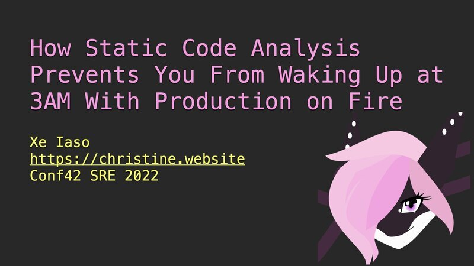

大家好，我是Xe Iaso。今天我要讲的是静态分析以及它如何帮助你设计出更可靠的系统。这将帮助您避免写下在凌晨3点破坏生产环境的错误代码。有很多工具可以为各种语言做这间事情，但是我将专注于Go，因为我是这方面的专家。在这次演讲中，我将谈及问题范围，一些你现在可以应用的解决方案，以及你如何与人们一起设计更可靠的系统。

我曾说过，我是Xe。我是Tailscale公司基础设施部门的架构师。我做SRE足够长时间了，因此我已经转向开发人员关系。作为免责声明，这个演讲可能包含观点。这些都不是我上司的意见。

在会议结束后的一两天内，我会有这次演讲的录音，幻灯片，讲稿，以及一份会议记录。屏幕角落的二维码会带你到我的博客。

当开始思考问题时，我发现开始思考问题范围是有帮助的。这通常意味着在一个难以置信的高水平上思考整个问题。

让我们考虑一下编译器的问题范围。在可能的最高级别上，编译器可以将任何东西作为输入，并可能产生输出。

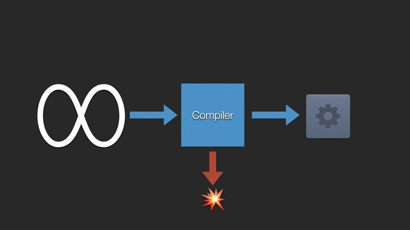

编译器的工作是接受任何东西，看看它是否匹配一组规则，然后产生某种输出。对于Go编译器来说，这意味着输入需要匹配Go语言在其规范中定义的规则。

该规范概述了可供阅读的Go语言的核心规则。这些问题包括每个.go文件需要放在一个包中，在使用变量之前需要声明变量，语言中的核心类型是什么，如何处理片，等等。

然而，这个规范并没有定义什么是正确的Go代码。它只定义了有效的Go代码是什么。这对这种规格来说很正常，确保正确性是计算机科学研究的一个活跃领域，而像谷歌、微软和苹果这样的小型初创公司正在努力解决这个问题。

因此，您不能依赖编译器本身来阻止将不正确的代码部署到生产环境中。很多细小的错误会在过程中停止，但它不会停止更细微的错误。这是Go编译器可以自己捕获的错误类型的一个例子，如果你声明一个整数值，你就不能把一个字符串放在里面。它们是不同的类型，编译器会拒绝它。

我知道你们中可能有人会想:“那其他语言呢，比如Rust和Haskell?”那些编译器不是以正确性著称吗?”

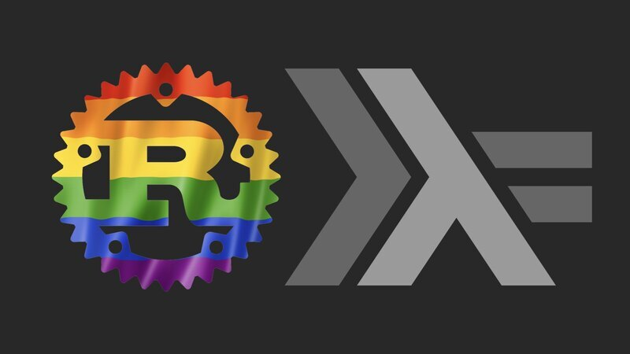

这是一个很好的观点，还有其他语言有更严格的规则，比如线性类型和显式标记戳外部世界。然而，这篇演讲中提到的错误仍然可能在这些语言中发生，即使意外地发生更困难。

在现有编译器上的静态分析可以让你更接近正确性，而不用像使用Rust或Haskell那样走最大化路线。

这是实用主义和正确之间的平衡。实用的解决方案和正确的解决方案总是冲突的，所以你需要找到一种介于两者之间的方法。

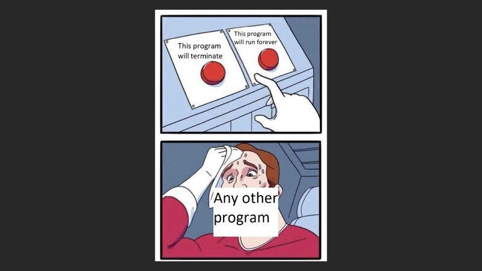

一般来说，用静态分析来证明一切都是正确的是不可能的。从理论上讲，我们需要花费大量的时间来判断代码的每一个方面是否在每一个方面都是正确的。在这种情况下，完美是优秀的敌人，所以以下是一些可以用Go中的静态分析来证明的模式:

- 忘记关闭HTTP响应体
- 在结构标签中制造错别字
- 确保可取消的上下文以简单可证明的方式被取消
- 写入无效的时间格式
- 编写一个无效的正则表达式，在运行时崩溃

这些东西很容易证明，并且默认在go vet和staticcheck中启用。

另外，不正确的代码不会在运行时立即崩溃。问题在于这些细节是如何不正确的，以及这些事情是如何堆积起来造成下游问题的。错误的代码在调试时也会使您感到困惑，这可能会浪费您原本可以用来做其他事情的时间。

这是一个将编译的Go代码示例，可能会工作，但是不正确的。

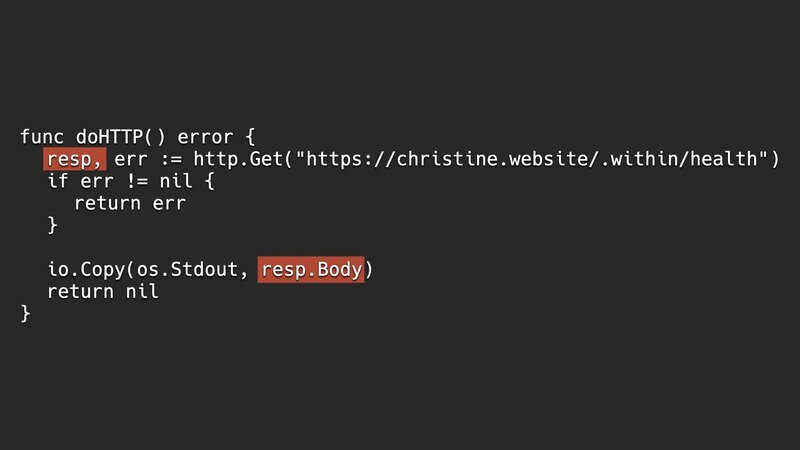

这是不正确的，因为HTTP响应被读取，但从未关闭。如果在Go中做不到这一点，就会导致与HTTP连接相关的资源泄漏。当您关闭响应时，它将释放连接，以便将其用于其他HTTP操作。

如果你不这样做，你很容易就会陷入服务器应用程序在凌晨3点耗尽可用套接字的状态。所以你可能会想这样修复它:

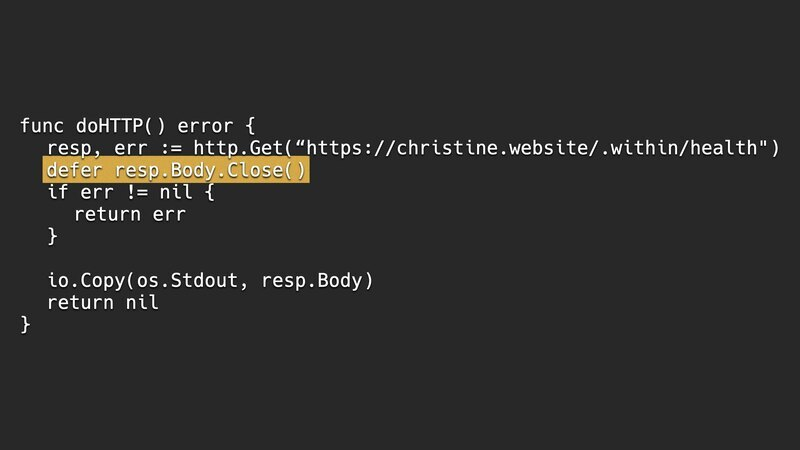

然而，这也是不正确的。查看调用defer的位置。

让我们考虑一下程序流程将如何工作。我将把它转换成一个程序如何执行的图表。

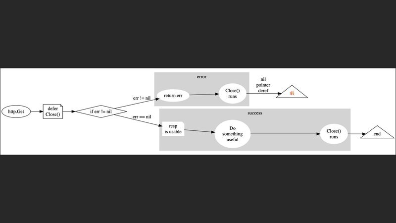

这个流程图是另一种思考程序如何执行的方式。它从左边开始，流到右边结束。

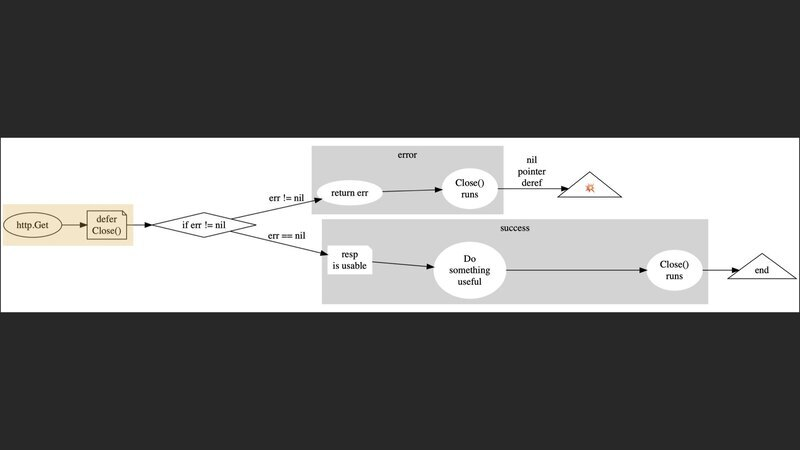

在本例中，我们从http dot Get调用开始，然后延迟关闭响应体。然后检查是否有错误。

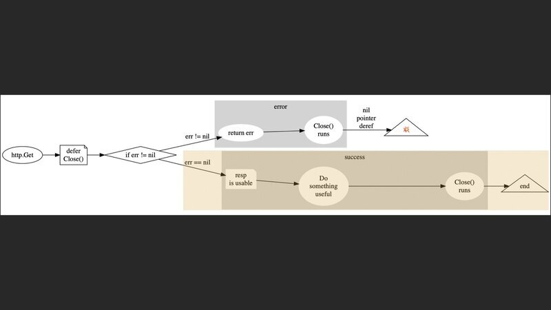

如果没有错误，我们可以使用响应并做一些有用的事情，然后响应主体由于延迟关闭而自动关闭。一切都按预期进行。

然而，如果出现错误，就会发生不同的事情。返回错误，然后运行预定的Close调用。Close调用假定响应是有效的，但实际上不是。这导致程序恐慌，即在凌晨3点崩溃。这就是静态分析能够拯救您的地方。让我们看看go vet对这段代码是怎么说的:

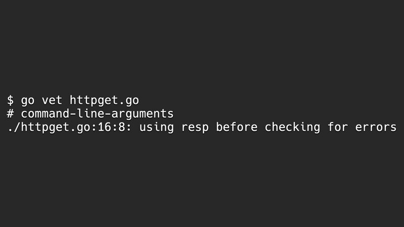

它捕获了那个错误!为了解决这个问题，我们需要将defer调用移动到错误检查之后，就像这样:

当我们知道响应体可用后，它就关闭了。这将像我们期望的那样在生产中工作。这是一个示例，说明了如何使用一点额外的工具来修复微小的错误，而不必使用完全的最大化方法。

如果你使用go test，那么默认情况下会运行大量的go vet检查。这涵盖了各种各样的常见问题，通过简单的修复可以帮助您的代码向相应的Go习惯用法移动。它仅限于已知不存在假阳性的测试子集，因此，如果您希望获得更多的保证，您将需要在持续集成步骤中运行go vet。

Mara： 如果这些都是可以检测到的，为什么这不是正常的构建流程的一部分?

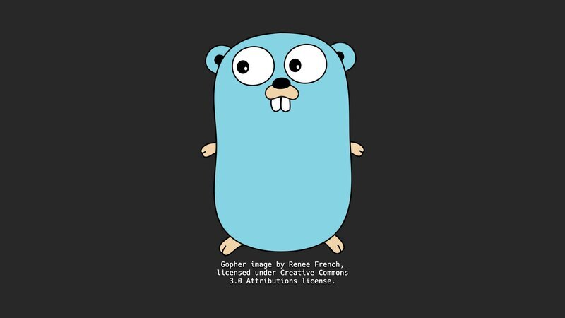

这不是默认的原因是一种哲学问题。Go并不是一种不可能编写有bug的代码的语言。Go只是想给你一些工具，让你的生活更轻松。

在Go团队看来，他们宁愿编译有bug的代码，也不愿让编译器意外地拒绝您的代码。

这是一种相信程序员和生产服务器之间存在差距的哲学的结果。在这些空白期间，除了人工审查之外，还有诸如Staticcheck和go vet之类的工具。

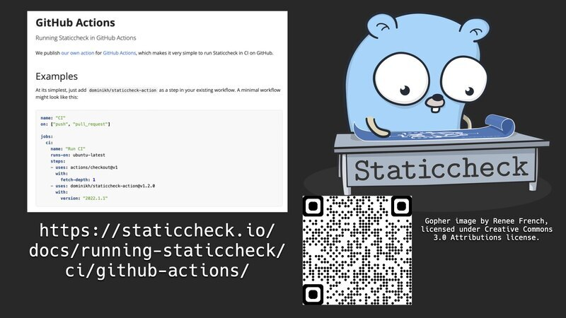

下面是Staticcheck可以捕获的一个更复杂的问题的示例。

Go允许你创建作用域为if语句的变量。这样你就可以像这样编写代码:

它是这样写的简写:

这个在做同样的事情，但它看起来更丑。err值不在内联块末尾的范围内，因此它将被垃圾收集器删除。

不过，我们还要考虑这个代码片段的另一个重要部分:变量隐藏。

我们有两个名为x的不同变量，它们是不同的类型，并在不同的地方声明。为了区分它们，我把里面的涂成了黄色，外面的涂成了红色。

在这样的类型断言中，红色变量不是整型，但黄色变量是可能断言失败的整型。如果它不能向下断言，那么黄色的x变量将始终是一个值为0的int型变量。这可能不是您想要的，因为带有%T格式说明符的日志调用会让您知道红色的x变量是什么类型。

当这段代码运行时，你会得到这样的错误消息:

这会把你弄糊涂的。这里的正确修复是重命名x的int版本。你可以用几种方法来做到这一点，但这里有一个有效的方法:

这将得到正确的结果。您需要更改if语句的ok分支，以使用xInt而不是x，但是Go语言服务器通常可以自动完成这一操作(在Emacs中，您需要按下M-x并输入lsp-rename并按下enter键)。

Staticcheck默认运行的还有其他一些检查，我可以很容易地花几个小时讨论它们，但我将重点讨论一个更有趣的微妙的检查。

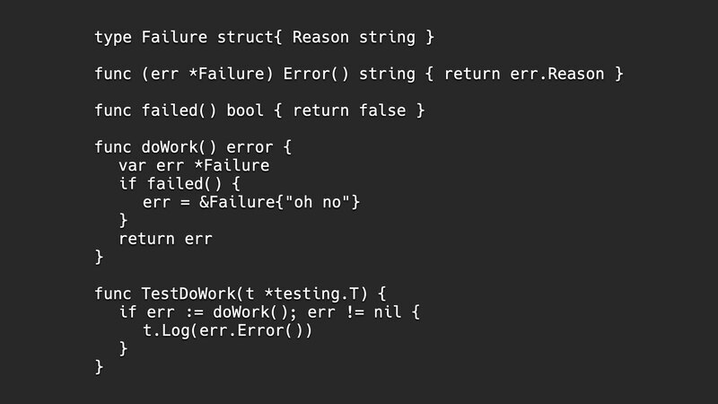

在Go中，编写自定义错误类型是一种常见的模式。通过Go接口及其“duck typing”，任何与错误接口定义匹配的东西都可以用作错误值。

Failure类型有一个Error方法，这意味着我们可以将其视为错误。

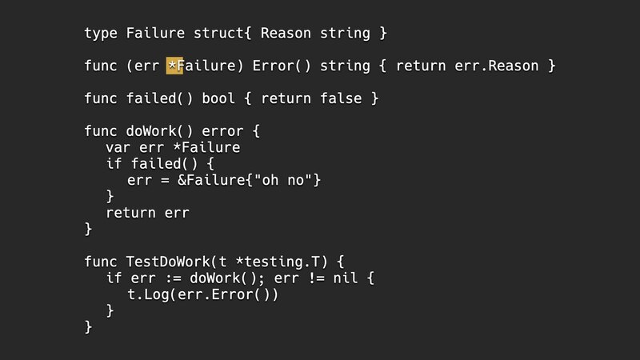

然而，函数的接收端是一个指针值。通常这意味着一些事情，但在这种情况下，它意味着接收者可能是nil。

正因为如此，我们可以返回一个nil的Failure值，但是当你试图从Go中使用它时，它会在运行时爆炸:

嘣!崩溃!段错误!

这是因为在底层，每个接口值都是一个框。这个方框包含方框中值的类型和一个指向实际值本身的指针。但是，即使底层值为nil，这个方框也会一直存在。

当您遇到它时，这总是令人沮丧的，但是让我们看看当您对这段代码运行Staticcheck时会说什么:

静态检查将拒绝它。如果将此代码检入源代码控制，并且在CI中运行Staticcheck，那么测试将失败。

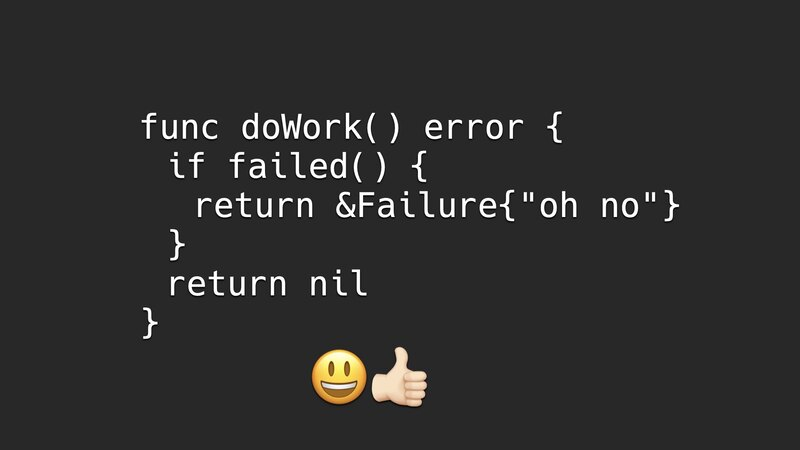

正确的doWork版本应该是这样的。

请注意，我如何将失败案例更改为使用未输入的nil。这可以防止nil值被封装到接口中。这样做是对的。

这将帮助您确保此类代码永远不会进入生产环境，因此在您睡觉时，它不会在无数个夜晚出现故障。

作为SREs，我们往往睡眠很少。据统计，当我们做这份工作的时间越来越长时，我们会有更高的倦怠、思维模糊、疲劳的几率，并有可能变成愤怒、悲伤的人。尤其是当一家公司的文化被破坏到你不得不在睡觉时间随叫随到的时候。

这是不健康的。因为一些微不足道的、可以避免的错误而在半夜被吵醒，这是不可持续的。如果我们在夜里醒来，那应该是为了那些可测量的新奇事物，而不是由一开始就不应该被允许部署的错误引起的。

我想我已经好几年没听到呼机的声音了，但上次听到呼机的声音时，我差点恐慌发作。我曾经因为寻呼机而精疲力竭，严重影响了我的健康。

我还在从那次SRE任务的后遗症中恢复，它导致我做出了永久性的职业改变，这样我就再也不会陷入那种境地。我不希望任何人遭受这种痛苦。

通常情况下，当你是一个SRE被呼入火线时，事情会是这样的。这感觉就像解决生产问题和获得更多睡眠都是不可行的，你将很难从一边走到另一边。

将静态分析添加到持续集成设置中可以让您在这两个极端之间走一条中间道路。它不会是完美的，无论事情会逐渐好转。

微小的错误将被阻止进入生产，您将能够更容易地睡眠。

能够像这样更轻松地休息的好处有很多，在我剩下的短短时间里很难总结出来。它可以挽救你和你爱的人的关系。它可以防止你身边的人怨恨你。

这可能是一份长久而快乐的职业生涯，也可能是25岁就不得不退出科技行业的区别;筋疲力尽，什么都做不了。

这可能是生命和因可预防的心脏病而过早死亡之间的区别。

在这样的谈话中，人们很容易忽视这样一个事实，即负责确保服务可靠的人是。人类。公司文化可能会成为阻碍，可能缺乏愿意或能够进行寻呼机轮换的人。

然而，当机器来取代我们的工作时，我希望这是它们首先取代的之一。

与此同时，我们所能做的就是创造一个更可持续的未来。我们能做的最好的事情是确保人们睡得很好，而不必担心因为诸如Staticcheck这样的工具可能阻止进入生产的错误而被吵醒。

如果您在生产中使用Go，我强烈建议使用Staticcheck。如果你觉得它有用，请在GitHub上赞助Dominik。这样的软件开发起来很复杂，确保Dominik能够继续开发它的最好方法就是为他的努力支付报酬。他睡得越好，你作为SRE睡得就越好。

至于其他语言，我不知道什么是最佳实践。你需要对此进行研究，你可能需要和同事一起找出对你的团队来说最好的选择。不过，这是值得的。这有助于你为每个人创造更好的产品，一开始的痛苦是值得的。

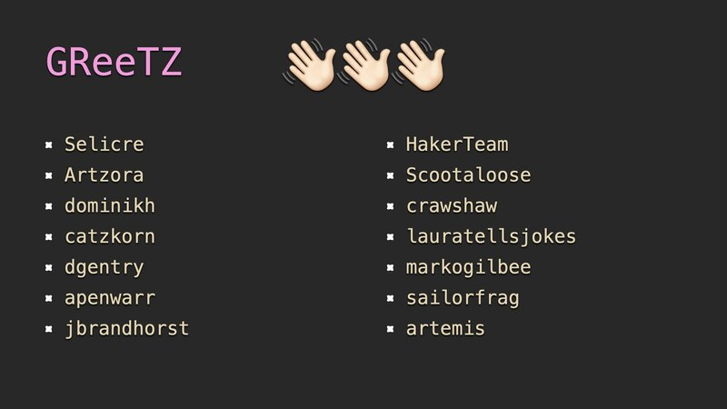

我的演讲快结束了，但我想对所有帮助使这次演讲成为现实的人发出特别的呼喊。我还想特别感谢我在Tailscale的同事们，他们让我可以集中精力让这个演讲发光发亮。

谢谢收看!我会继续提问，但如果我错过了你的问题，你真的想要一个答案，请发送电子邮件到code42sre2022@xeserv.us。我很乐意回答问题，我也喜欢写回答。