# How_Static_Code_Analysis_Prevents_You_From_Waking_Up_at_3AM_With_Production_on_Fire

- 原文地址：https://xeiaso.net/talks/conf42-static-analysis
- 原文作者：Xe Iaso
- 本文永久链接：https://github.com/gocn/translator/blob/master/2022/w19_How_Static_Code_Analysis_Prevents_You_From_Waking_Up_at_3AM_With_Production_on_Fire.md
- 译者：[tt](https://github.com/1-st)
- 校对：

Hi, I’m Xe Iaso and today I’m going to talk about static analysis and how it helps you engineer more reliable systems. This will help you make it harder for incorrect code to blow up production at 3AM. There are a lot of tools out there that can do this for a variety of languages, however I’m going to focus on Go because that is what I am an expert in. In this talk I’ll cover the problem space, some solutions you can apply today and how you can work with people to engineer more reliable systems.

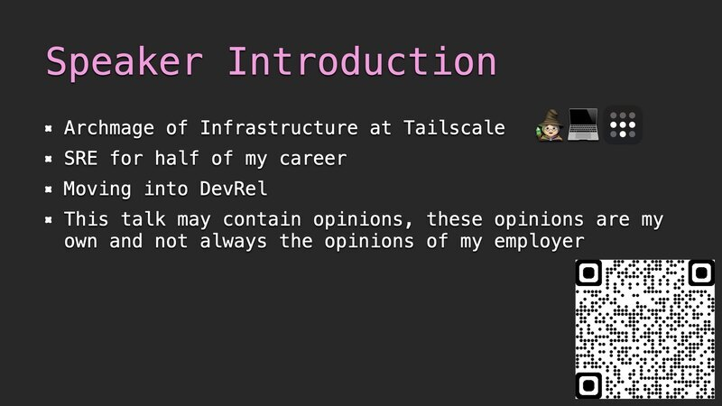

As I said, I’m Xe. I’m the Archmage of Infrastructure at Tailscale. I’ve been an SRE for long enough that I have moved over into developer relations. As a disclaimer, this talk may contain opinions. None of these opinions are of my employer.

I’ll have a recording of this talk, slides, speaker notes, and a transcript of up in a day or two after the conference. The QR code in the corner of the screen will take you to my blog.

When starting to think about the problem, I find it helps to start thinking about the problem space. This usually means thinking about the total problem at an incredibly high level.

So let’s think about the problem space of compilers. At the highest possible level, a compiler can take literally anything as input and maybe produce an output.

A compiler’s job is to take this anything, see if it matches a set of rules and then produce an output of some kind. In the case of the Go compiler, this means that the input needs to match the rules that the Go language has defined in its specification.

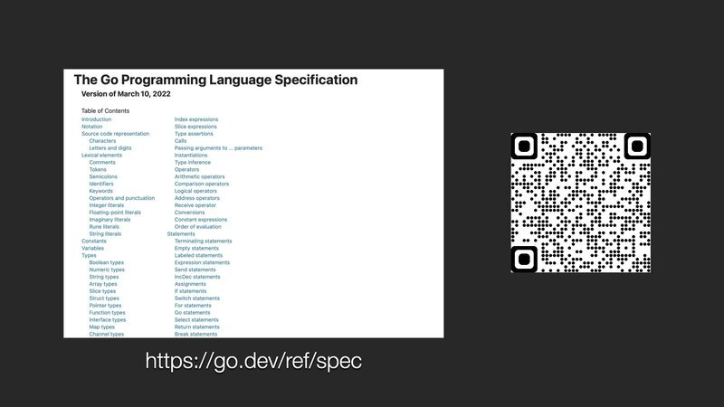

This human-readable specification outlines core rules of the Go language. These include things like every .go file needs to be in a package, the need to declare variables before using them, what core types are in the language, how to deal with slices, etc.

However this specification doesn’t define what correct Go code is. It only defines what valid Go code is. This is normal for specifications of this kind, ensuring correctness is an active field of research in computer science that small scrappy startups like Google, Microsoft and Apple struggle with.

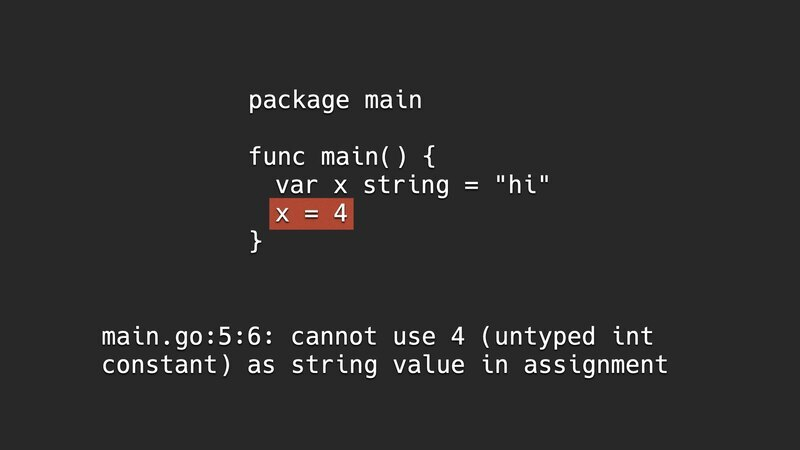

As a result though, you can’t rely on the compiler itself from stopping incorrect code to be deployed into production. A lot of trivial errors will be stopped in the process, but it won’t stop more subtle errors. This is an example of the kind of error that the Go compiler can catch by itself, if you declare a value as an integer you can’t then put a string in it. They are different types and the compiler will reject it.

I know one of you out there is probably thinking something like “What about other languages like Rust and Haskell? Aren’t those compilers known for correctness?”

That’s a good point, there are other languages that have more strict rules like linear types and explicitly marking poking the outside world. However the kinds of errors that are brought up in this talk can still happen in those languages, even if it’s more difficult to do that by accident.

Static analysis on top of your existing compiler lets you move closer to correctness without going the maximalist route like when using Rust or Haskell.

It’s a balance between pragmatism and correctness. The pragmatic solution and the correct solution are always in conflict, so you need to find a way down the middle.

In general, proving everything is correct with static analysis is impossible. It takes a theoretically infinite amount of time to tell if absolutely every facet of the code is correct in every single way. This is a case where the perfect is the enemy of the good, so here are some patterns for things that can be proven with static analysis in Go:

- Forgetting to close an HTTP response body
- Making typos in struct tags
- Ensuring that cancellable contexts get cancelled in trivially provable ways
- Writing invalid time formats
- Writing an invalid regular expression that would otherwise blow up at runtime

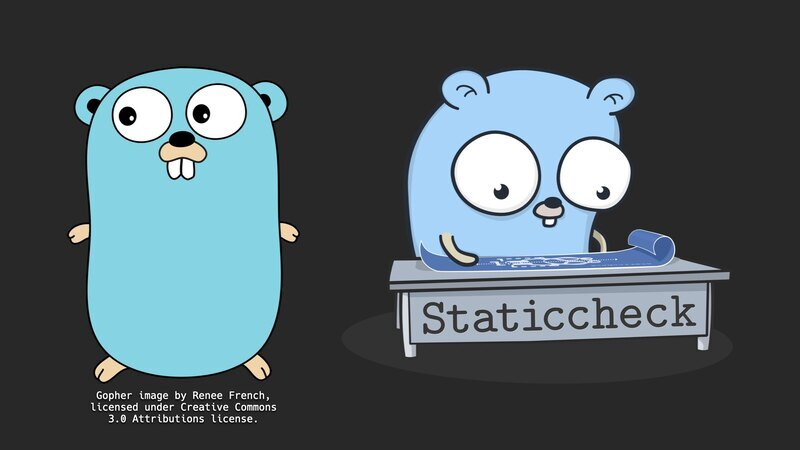

These kinds of things are easy to prove and are enabled by default in go vet and staticcheck.

Also for the record, incorrect code won’t explode instantly upon it being run. The devil is in the details of how it is incorrect and how those things can pile up to create issues downstream. Incorrect code can also confuse you while trying to debug it, which can make you waste time you could spend doing anything else.

This is an example of Go code that will compile, will likely work, but is incorrect.

This is incorrect because the HTTP response is read from, but never closed. Failing to do this in Go will cause you to leak the resources associated with the HTTP connection. When you close the response, it releases the connection so that it can be used for other HTTP actions.

If you don’t do this, you can easily run into a state where your server application will run out of available sockets at 3AM. So you may be tempted to fix it like this:

However this is incorrect too. Look at where the defer is called.

Let’s think about how the program flow will work. I’m going to translate this into a diagram of how this program will be executed.

This flowchart is another way to think about how this program is being executed. It starts on the left side and flows to the end on the right.

In this case we start with the http dot Get call and then defer closing the response body. Then we check to see if there was an error or not.

If there wasn’t an error, we can use the response and do something useful, then the response body closes automatically due to the deferred close. Everything works as expected.

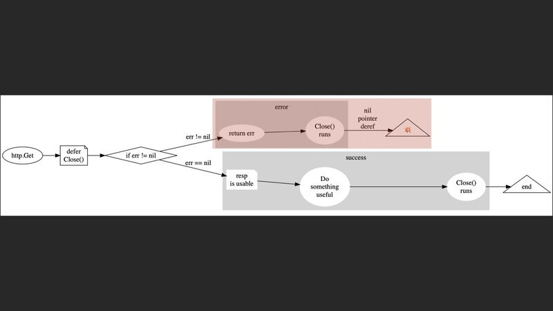

However if there was an error, something different happens. The error is returned and then the scheduled Close call runs. The Close call assumes that the response is valid, but it’s not. This results in the program panicking which is a crash at 3AM. This is the kind of place that static analysis comes in to save you. Let’s take a look at what go vet says about this code:

It caught that error! To fix this we need to move the defer call to after the error check like this:

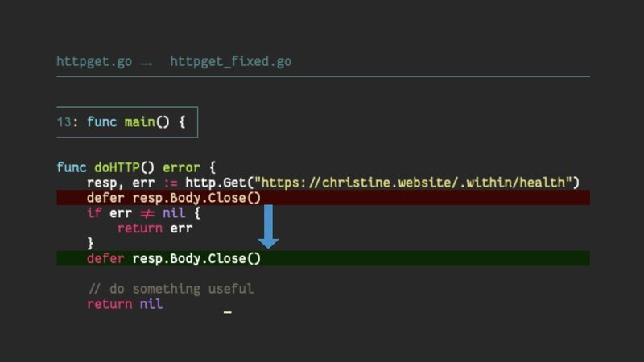

The response body is closed after we know it’s usable. This will work as we expect in production. This is an example of how trivial errors can be fixed with a little extra tooling without having to use an entirely maximalist approach.

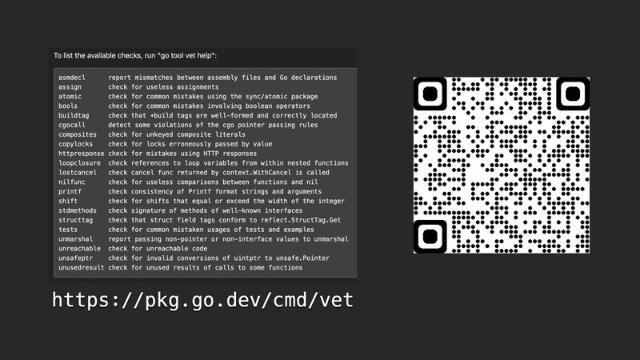

If you use go test then a large amount of go vet checks are run by default. This covers a wide variety of common issues with trivial fixes that help move your code towards the corresponding Go idioms. It’s limited to the subset of tests that aren’t known to have false positives, so if you want to have more assurance you will need to run go vet in your continuous integration step.

Mara is hmm
<Mara> If these are so trivially detectable, why isn’t this part of the normal go build flow?

The reason this isn’t done by default is kind of a matter of philosophy. Go isn’t a language that wants to make it impossible to write buggy code. Go just wants to give you tools to make your life easier.

In the Go team’s view, they would rather buggy code get compiled than have the compiler reject your code on accident.

It’s the result a philosophy of trusting that there are gaps between the programmer and production servers. During those gaps there are tools like Staticcheck and go vet in addition to human review.

Here’s an example of a more complicated problem that Staticcheck can catch.

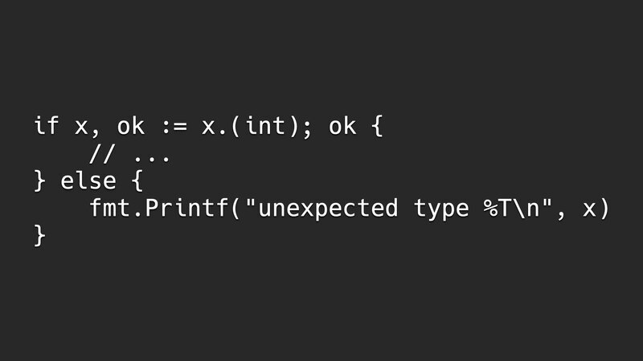

Go lets you make variables that are scoped to if statements. This lets you write code like this:

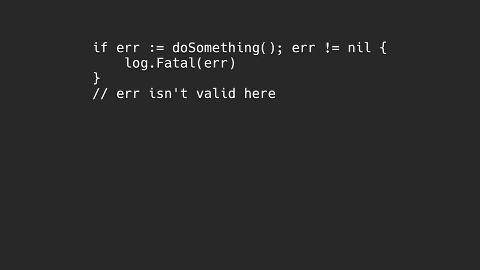

Which is shorthand for writing out something like this:

This does the same thing, but it looks a bit more ugly. The err value isn’t in scope at the end of the inline block, so it will be dropped by the garbage collector.

However let’s also consider the other important part of this snippet: variable shadowing.

We have two different variables named x and they are different types and declared at different places. To help tell them apart I’ve coloured the inner one yellow and the outer one red.

In a type assertion like this the red variable is not an int but the yellow variable is an int that might have failed to assert down. If it fails to assert down, then the yellow x variable will always be an int have the value 0. This is probably not what you want, given that the log call with %T format specifier would let you know what type the red x variable was.

When this code is run, you will get an error message like this:

This will confuse the living hell out of you. The correct fix here is to rename the int version of x. You could do this in a few ways, but here’s a valid approach:

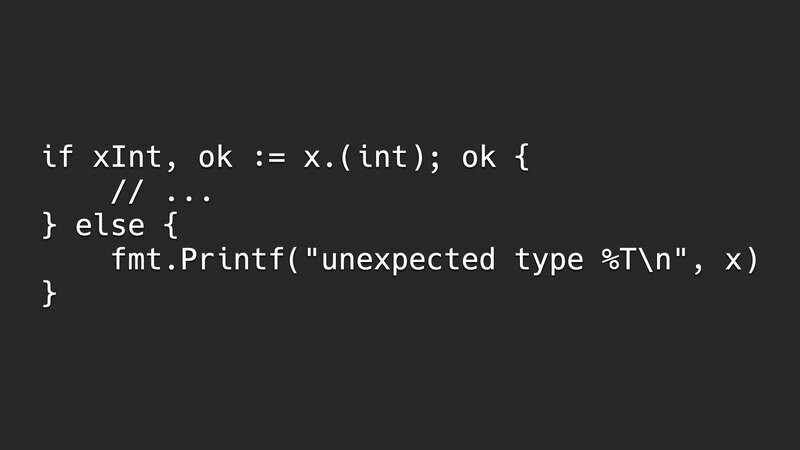

This will get the correct result. You would need to change the ok branch of the if statement to use xInt instead of x, but the Go language server can usually automate this (in Emacs you’d press M-x and type in lsp-rename and hit enter).

There are a bunch of other checks that Staticcheck runs by default and I could easily talk about them for a few hours, but I’m gonna focus on one of the more interestingly subtle checks.

In Go it’s a common pattern to write custom error types. With Go interfaces and their “duck typing”, anything that matches the definition of the error interface is able to be used as an error value.

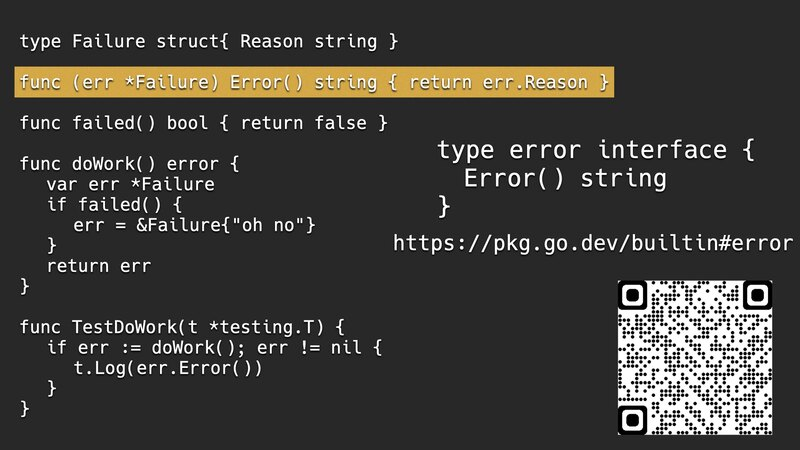

The type Failure has an Error method, which means that we can treat it as an error.

However the receiver of the function is a pointer value. Normally this means a few things, but in this case it means that the receiver may be nil.

Because of this we can return a nil value of Failure, but then when you try to use it from Go it will explode at runtime:

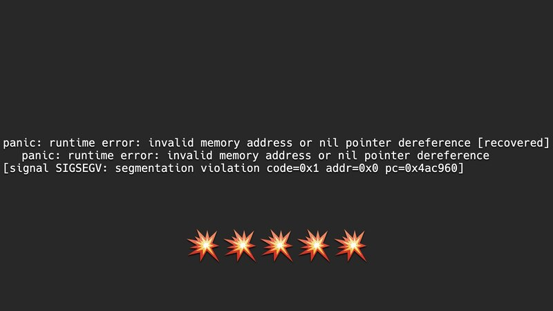

Boom! It crashed! Segfault!

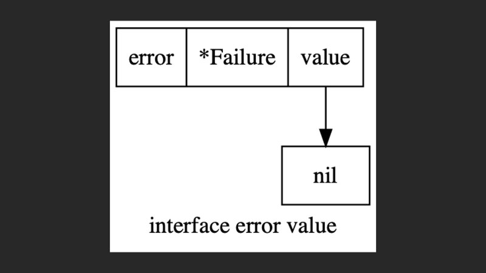

This happens because under the hood each interface value is a box. This box contains the type of the value in the box and a pointer to the actual value itself. But, this box will always exist even if the underlying value is nil.

This is always frustrating when you run into it, but let’s see what Staticcheck says when you run it against this code:

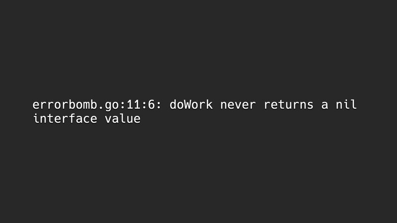

Staticcheck will reject it. If this code was checked into source control and Staticcheck was run in CI, tests would fail.

The correct version of doWork should look like this.

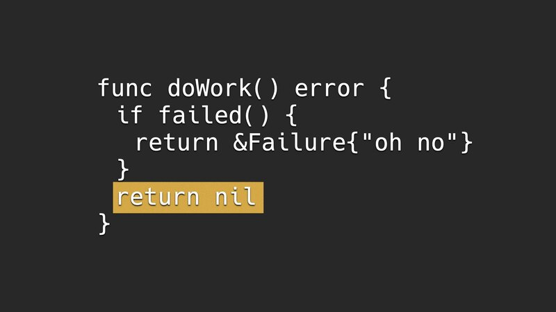

Note how I changed the failure case to use an untyped nil. This prevents the nil value from being boxed into an interface. This will do the right thing.

This will help you ensure that this kind of code never enters production so it cannot fail at untold hours of the night while you are sleeping.

As SREs, we tend to sleep very little as is. Statistically we have higher rates of burnout, mind fog, fatigue and likelihood of turning into angry, sad people as we do this job longer and longer. Especially if the culture of a company is broken enough that you end up being on call during sleeping hours.

This is not healthy. It is not sustainable for us to be woken up at obscene hours of the night because of trivial and preventable errors. If we get woken up in the night, it should be for things that are measurably novel and not caused by errors that should have never been allowed to be deployed in the first place.

I don’t think I’ve heard my pager sound in years by this point, but the last time I heard it I almost had a full blown panic attack. I have been in the kind of place where burnout from the pager severely affected my health.

I’m still recovering from the after-effects of that tour of SRE duty, and it has resulted in me making permanent career changes so that I am never put in that kind of position again. I don’t wish this hell on anyone.

Normally things can feel like this when you are an SRE put in the line of pager fire. It feels like both fixing production and being able to get more sleep are unworkable and that you would have severe difficulty getting from one side to the other.

Adding static analysis to your continuous integration setup can allow you to walk down a middle path between these two extremes. It is not going to be perfect, however gradually things will get better.

Trivial errors will be blocked from going into production and you will be able to sleep easier.

The benefits of being able to rest easier like this are numerous and difficult to summarize in the short amount of time I have left. It could save your relationship with your loved ones. It could prevent people near you from resenting you.

It could be the difference between a long and happy career or having to drop out of tech at 25; burnt out to a crisp and unable to do much of anything.

It could be the difference between life and an early, untimely death from a preventable heart attack.

In talks like these it’s easy to ignore the fact the people that are responsible for making sure services are reliable are that. Human. Company culture may get in the way, there may be a lack of people that are willing or able to take the pager rotation.

However when the machines come to take our jobs, I hope this one is one of the first that they take.

In the meantime, all we can do is get towards a more sustainable future. And the best thing we can do is make sure people sleep well without having to worry about being woken up because of errors that tools like Staticcheck can block from getting into production.

If you use Go in production, I highly suggest using Staticcheck. If you find it useful, sponsor Dominik on GitHub. Software like this is complicated to develop and the best way to ensure Dominik can keep developing it is to pay him for his efforts. The better he sleeps, the better you sleep as an SRE.

As for other languages, I don't know what the best practices are. You will have to do research on this, you may have to work together with coworkers to figure out what would be the best option for your team. It is worth the effort though. This helps you make a better product for everyone, and it's worth the teething pains at first.

I’m almost at the end of the presentation, but I wanted to give a special shout out to all of these people who helped make this talk a reality. I want to also give out a special shout out to my coworkers at Tailscale that let me load shed so I could focus on making this talk shine.

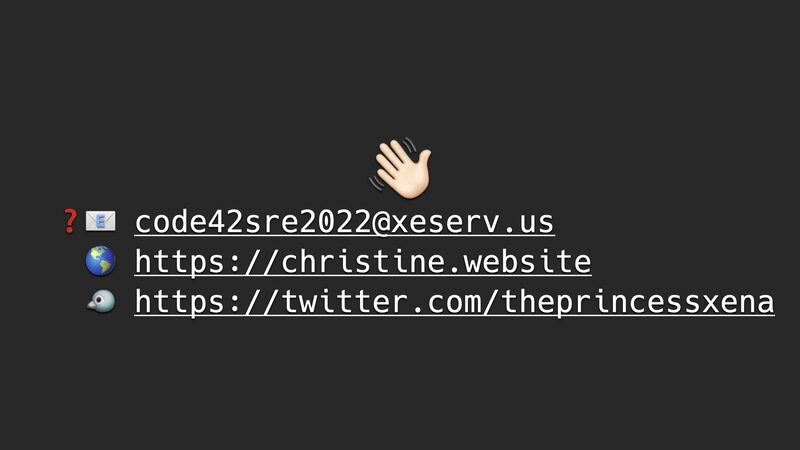

Thanks for watching! I’ll stick around in the chat for questions, but if I miss your question and you really want an answer to it, please email it to code42sre2022@xeserv.us. I’m happy to answer questions and I enjoy writing up responses.