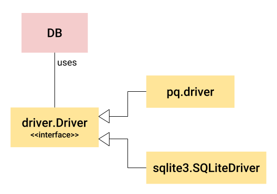

原文地址：https://eli.thegreenplace.net/2019/design-patterns-in-gos-databasesql-package/

原文作者：[Eli Bendersky](https://eli.thegreenplace.net/)

本文永久链接：[https://github.com/gocn/translator/blob/master/2022/w44_Design_patterns_in_Go_databasesql_package.md](https://github.com/gocn/translator/blob/master/2022/w44_Design_patterns_in_Go_databasesql_package.md)

译者：[zxmfke](https://github.com/zxmfke)

校对：

### 探究 Go database/sql 包的设计模式

------

使用 Go 中的 SQL database 是容易的，只需下列这三步：

```go
// 步骤 1：导入主要的 SQL 包
import "database/sql"

// 步骤 2：导入一个驱动包来明确要使用的 SQL 数据库
import _ "github.com/mattn/go-sqlite3"

// 步骤 3：用一个注册好的驱动名称来打开一个数据库
func main() {
  // ...
  db, err := sql.Open("sqlite3", "database.db")
  // ...
}
```

从这时候开始，对象 `db` 可以用相同的代码来查询和修改所有支持的 SQL 数据库。如果我们想从 SQLite 转到 PostgreSQL，类似的做法只需要导入另个一数据库的驱动包，以及在调用 `sql.Open`[[1\]](https://eli.thegreenplace.net/2019/design-patterns-in-gos-databasesql-package/#sql1) 时传入另一个驱动名称。

在这篇博客里，我想简述一些 `database/sql` 背后的设计模式及架构。

## 主要的设计模式

`database\sql` 的架构受一个整体的设计模式制约。我尝试分析它可能是哪个经典的设计模式，然后[策略模式](https://en.wikipedia.org/wiki/Strategy_pattern)看起来比较接近，尽管它不是那么的一致。如果你认为哪个设计模式更符合，请告诉我 [[2\]](https://eli.thegreenplace.net/2019/design-patterns-in-gos-databasesql-package/#sql2)。

它看起来像这样：我们有一个想要呈现给用户的通用接口，并有一个针对每个数据库后端的实现。很显然，它听起来很像经典的接口+实现，Go在这方面特别擅长，它对接口的支持很强大。

所以第一个想法会是：创建一些用户会交互的 `DB` 接口，并且每个数据库后端都实现这些接口。听起来是不是很简单？

当然，但使用这个方法会有一些问题。记住的是 Go 建议接口尽量小，也就是实现较少的方法。这里我们需要较大一点的 `DB` 接口，而这导致了一些问题：

2. 添加面向用户的能力是很困难的，因为他们可能需要对接口添加额外的方法。这个破坏了所有接口的实现，并且需要许多独立的项目去维护它们的代码。
3. 让所有数据库后端封装相同的方法是困难的，因为如果用户想直接加方法到 `DB` 接口，是没有一个原生(不能直接修改接口的方法)的地方去添加的。它需要每个后端独立地实现，这是很浪费的，逻辑也是非常复杂的。
4. 如果后端想增加可选的能力，对一个单一的接口来说，不为特定的后端采用类型转换，这是具有挑战性的。

因此，一个更好的想法应该像这样：从后端接口分离出面向用户的类型及方法。如图所示：



`DB` 是一个面向用户类型。不是一个接口，而是一个在 `database/sql`包内实现的一个*具体*类型（一个结构）。它是与后端是分隔开的，封装了许多后端通用的功能，就像[连接池](https://en.wikipedia.org/wiki/Connection_pool)。

为了做后端特定的工作（比如向实际的数据库发出 SQL 查询），`DB`使用一个叫做`database/sql/driver` 的接口。`Driver` (以及其他几个定义连接、事务等的接口)。这个接口是低级别的，它由每个数据库后端实现。在上图中，我们看到 `pq` 包的实现 (PostreSQL 的实现) 以及 `sqlit3` 包的实现。

这个方法优雅地帮助 `database/sql` 解决了在前面提到的问题：

2. 现在增加面向用户的能力不一定需要改变接口，只要该能力可以在独立于后端（``DB``和它的姐妹类型）中实现即可。
3. 所有数据库后端共有的功能现在有了一个可以修改的位置。虽然我在前面提到了连接池，但是 `database/sql` 中独立于后端的类型在后端特定实现的基础上增加了很多其他的东西。另一个例子：处理与数据库服务器的错误连接的重试。
4. 如果后端增加了可选的能力，这些能力可以在独立于后端的层中被选择性地利用，而不用直接暴露给用户。

## 注册驱动

`database/sql` 的设计另一个有趣的方面是数据库驱动如何自己注册到 main 包里面。这是一个在 Go 中实现*编译时插件*的好例子。

正如本博客顶部的代码示例所示，`database/sql` 知道导入的驱动程序的名称，并且可以用 `sql.Open `按名称打开它们。它是如何实现的呢？

诀窍就在空白引用：

```go
import _ "github.com/mattn/go-sqlite3"
```

虽然它实际上没有从包中导入任何名字，但它调用了它的 `init` 函数，对于 `sqlite3` 来说，就是：

```go
func init() {
    sql.Register("sqlite3", &SQLiteDriver{})
}
```

在 `sql.go` 中，`Register` 添加了一个从字符串名称到 `driver.Driver` 接口实现的映射；该映射在一个全局映射中：

```go
var (
    driversMu sync.RWMutex
    drivers   = make(map[string]driver.Driver)
)

// Register makes a database driver available by the provided name.
// If Register is called twice with the same name or if driver is nil,
// it panics.
func Register(name string, driver driver.Driver) {
    driversMu.Lock()
    defer driversMu.Unlock()
    if driver == nil {
        panic("sql: Register driver is nil")
    }
    if _, dup := drivers[name]; dup {
        panic("sql: Register called twice for driver " + name)
    }
    drivers[name] = driver
}
```

当 `sql.Open` 被调用时，它在 `drivers`  映射中查找名称，然后会实例化一个 `DB` 对象，并附加适当的驱动实现。你也可以在任何时候调用 `sql.Drivers` 函数来获取所有注册的驱动的名称。

这个方法实现了一个*编译时*的插件，因为包含的后端的 `import` 是在 Go 代码编译时发生的。二进制文件中构建了一套固定的数据库驱动程序。Go 也支持 *运行时* 的插件，但是这是另一篇的主题。

## 实现 `Scanner` 接口的自定义类型

`database/sql `包的另一个有趣的结构特征是支持数据库中自定义类型的存储和检索。`Rows.Scan` 方法通常用于从行中读取列。 它把一连串的 `interface{}` 当作泛型，内部通过类型开关，根据一个参数的类型选择正确的 reader。

为了定制化，`Rows.Scan` 支持实现了 `sql.Scanner` 接口的类型，然后调用它们 `Scan` 方法来执行实际的数据读取操作。

一个内建例子是 `sql.NullString`。如果我们尝试 `Scan` 一个列到一个 `string` 参数：

```go
var id int
var username string
err = rows.Scan(&id, &username)
```

然后那个列有一个 `NULL` 的值，我们会得到一个错误：

```go
sql: Scan error on column index 1, name "username":
    unsupported Scan, storing driver.Value type <nil> into type *string
```

我们可以通过使用`sql.NullString` 来避免：

```go
var id int
var username sql.NullString
err = rows.Scan(&id, &username)
```

在这里，`username` 将把它的`Valid` 字段设置为`false`，因为它是 `NULL` 列。这个能够实现的原因是 `NullString` 实现了 `Scanner` 接口。

一个更有趣的例子涉及到某些数据库后端特有的类型。举个例子，虽然 PostgrSQL 支持 [数组类型](https://www.postgresql.org/docs/9.1/arrays.html)，但其他一些数据库（如 SQLite ）并不支持。所以 `database/sql` 不能原生支持数组类型，但是像 `Scanner` 接口这样的功能使得用户代码可以相较容易地与这些数据进行交互。

为了扩展前面的例子，假设我们的行也有每个用户\[[3\]](https://eli.thegreenplace.net/2019/design-patterns-in-gos-databasesql-package/#sql3)的 activities（作为字符串）。那么 `Scan` 就会像这样：

```
var id int
var username sql.NullString
var activities []string
err = rows.Scan(&id, &username, pq.Array(&activities))
```

`pq.Array` 函数是由 [pq PostgreSQL 绑定](https://godoc.org/github.com/lib/pq) 提供。 它接收一个分片，并将其转换为一个匿名类型，实现 `sql.Scanner` 接口。

这是一个很好的方法，在必要时可以*摆脱抽象*。 尽管有一个统一的接口来访问许多种数据库是很好的，但有时我们确实想使用一个特定的数据库，并具有其特定的功能。在这种情况下，放弃 `database/sql` 是很可惜的，不过我们也不必这样 - 因为这些功能让特定的数据库后端提供了自定义行为。

------

[[1\]](https://eli.thegreenplace.net/2019/design-patterns-in-gos-databasesql-package/#footnote-reference-1)  当然，假设我们在查询中只使用两个数据库，且都支持的标准SQL语法。

[[2\]](https://eli.thegreenplace.net/2019/design-patterns-in-gos-databasesql-package/#footnote-reference-2)  我第一次在最近加入的[Go CDK 项目](https://github.com/google/go-cloud)中遇到了关于这种模式的明确讨论。Go CDK 对其可移植类型使用了类似的方法，其[设计文档](https://github.com/google/go-cloud/blob/master/internal/docs/design.md#portable-types-and-drivers)称其为*可移植类型和驱动模式*。

[[3\]](https://eli.thegreenplace.net/2019/design-patterns-in-gos-databasesql-package/#footnote-reference-3)  我意识到，多值字段并不是好的关系设计。这只是一个例子。