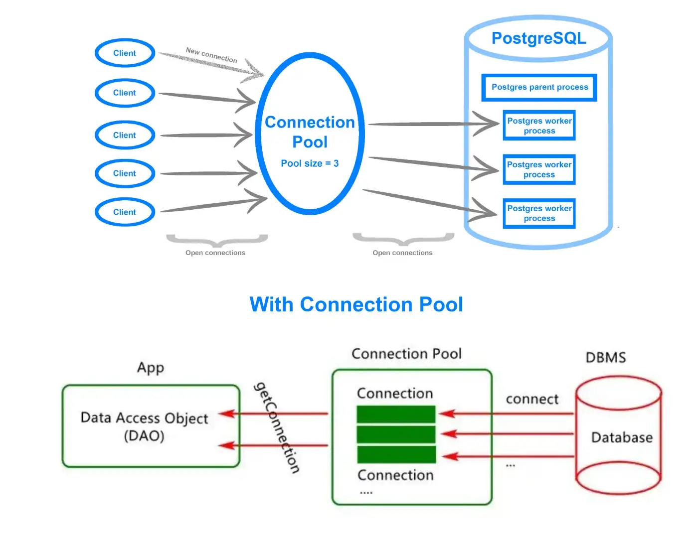
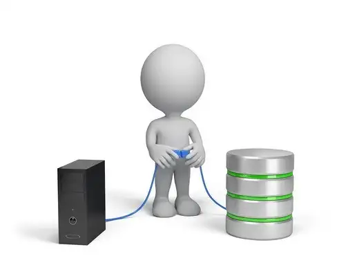
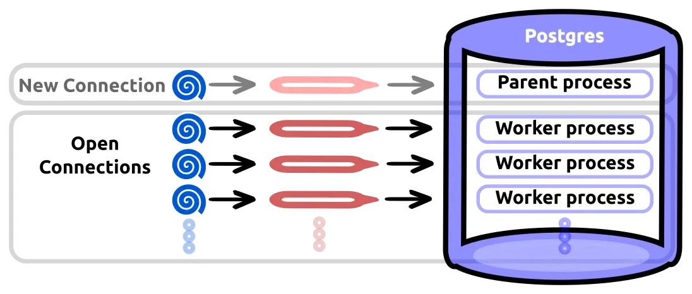
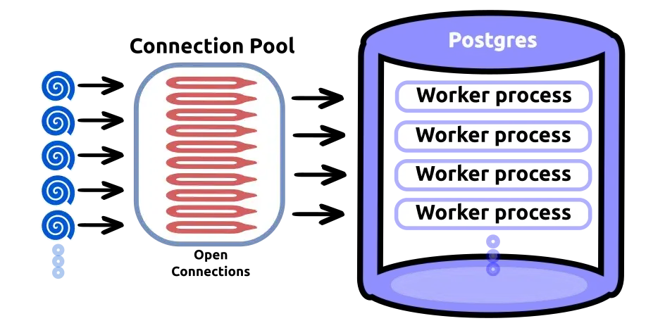

# Why do we need a Database Connection Pool? -every programmer must know

- 原文地址：<https://medium.com/javarevisited/why-do-we-need-a-database-connection-pool-every-programmer-must-know-9f90e7c8e5af>
- 原文作者：Dineshchandgr
- 本文永久链接：<https://github.com/gocn/translator/blob/master/2023/w01_why_do_we_need_a_database_connection_pool.md>
- 译者：[pseudoyu](https://github.com/pseudoyu)
- 校对：[小超人](https://github.com/focozz)

Hello everyone. In this article, we are going to look at Database connections and their life cycle. Then we will look at the [Connection Pool](https://javarevisited.blogspot.com/2012/06/jdbc-database-connection-pool-in-spring.html), its internals, and why we need to use it. Then we will look at the design patterns on where to place the connection pool. We will then look at the performance issues that can arise from the Database connection pool and conclude the article by looking at the common connection pool frameworks used in Java. Let's get started.



## What is a Database Connection

Any software application needs to store the data in a database and for the application to interact with a **database server**, we need a Database Connection. The **Database connection** is nothing but a way for the application software to interact with the database server software and we use the connection to send **commands (SQL) to the database** and obtain the response from the database in the form of a [Result Set](http://www.java67.com/2018/01/jdbc-how-to-get-row-and-column-count-from-resultset-java.html).



The database application usually runs in a **dedicated server** called a **database server** which is different from the application servers. The database application runs in a specific port in the database server on which the application server can send commands and receive the data. Eg: [MySQL database](https://medium.com/javarevisited/top-5-courses-to-learn-mysql-in-2020-4ffada70656f) application runs in a default port called 3306 in the database server machine. This is exactly the same way as the backend application running in port 8080.

Whenever a client like a browser or mobile requests data from the backend application, the backend application needs to talk to the database to retrieve the data and respond to the client.

If a backend application wants to connect to the database server application, it needs to make a call over [TCP-IP protocol](https://medium.com/javarevisited/5-best-books-and-courses-to-learn-computer-networking-tcp-ip-and-udp-protocols-5a0e4dce75fa) along with the **database server IP and Port** info and the credentials to connect. The process of the application server connecting to the database server to obtain data is achieved through a mechanism called **Database Connection**.

To build a Database connection, we need to provide the information like server URL that contains the host, port and the name of the database, driver, user name, and password as shown below

```yaml
db_url      = jdbc:mysql://HOST/DATABASE
db_driver   = com.mysql.jdbc.Driver
db_username = USERNAME
db_password = PASSWORD
```

Once a connection to the Database is created, it can be opened and closed at any time and we can even set the timeout for them.

Without an open connection, communication with the [database](https://medium.com/javarevisited/8-free-oracle-database-and-sql-courses-for-beginners-f4e9b25b33c4) cannot be done. Creating a Database connection is an expensive operation as there are a lot of steps involved. How we handle the database connection could make or break the entire application and it could even bring the entire application to stand still.

## Life Cycle of a Database Connection

Having seen in detail about the database connection above, lets us look at the **life cycle of a connection** i.e steps involved in creating a connection to the database from the application server


1. **Opening connection** to the database using the Connection String
2. **Authenticating user credentials** provided in the Connection String before establishing the connection
3. **Creating and opening a TCP socket** for reading/writing data
4. **Sending/receiving data** over the socket
5. Closing the **database connection**
6. Closing the **TCP socket**

Creating a connection with the database system with the number of steps involved is an expensive and time-consuming operation and if you create a **connection on the fly**, the **application will hang** and users will be experiencing slowness in the page loading. Moreover, if your application has a large scale of users and if you open a connection for every request, the number of simultaneous connections increases which in turn increases the **CPU and memory resources** which is very dangerous.

That is the reason we have **Connection Pools** by which we don't create new connections every time but reuse the existing connections. Without a connection pool, a **new database connection** is created for each client.

Let us look at what happens every time a Database Connection is created



In the diagram above, we can see that new connections are created to an RDMS database ie. Postgres

When a backend application connects to the PostgreSQL database, the **parent process** in the database server spawns a **worker process** that listens to the newly created connection. Spawning a work process each time also causes additional overhead to the database server. As the number of simultaneous connections increases, the CPU and memory resources of the database server also increase which could crash the database server.

## What is a Database Connection Pool

We saw above that it is inefficient for an application to create, use, and close a database connection whenever it needs to interact with the database. **Connection Pool** is a technique to address the problems associated with creating connections on the fly and to help to improve system performance.



Connection Pool is a **pool of database connections** that can be created ahead of time on application startup and then share the connection (*instead of creating a new one*) among the applications that need to access the database.

When the application is initialized, the provider creates a default connection provided **eg: 10 per server instance** and keeps them in its pool. This DB connection pool resides in the **Application Server’s memory**. When the application needs the connections, these connections from the pool are recycled as creating new connections for every request is a costly operation.

The connection object obtained from the connection pool is a **wrapper around the actual database connection** and the application that uses the connection from the pool is hidden from the underlying complexity. These connections are managed by a **Pool Connection Manager** which is responsible for managing the lifecycle of a connection inside the connection pool.

The approach of Connection Pool encourages opening a connection in an application only when needed and closing it as soon as the work is done without holding the connection open for the entire life of the application. With this approach, a relatively small number of connections can service a large number of requests, which is also known as **Multiplexing**.

The concept of a **Connection Pool** is similar to a **Server Thread Pool** or a [String Pool](http://javarevisited.blogspot.sg/2016/07/difference-in-string-pool-between-java6-java7.html) that facilitates the reusability of already created objects to save the overhead of creating them again thereby resulting in better application performance.

## How is a Database Connection reused from the Connection Pool

The below diagram clearly denoted how the clients use the connections from the pool.


## Why do we need a Connection Pool

Database connections are pooled for several reasons:

- Database connections are relatively expensive to create, so rather than create them on the fly we opt to create them beforehand and use them whenever we need to access the database.
- The database is a shared resource so it makes sense to create a pool of connections and share them across all business transactions.
- The database connection pool limits the amount of load that you can send to your database.

## Where to place the Database Connection Pool

There are two common ways of placing the Database Connection pool as shown below

### 1. Database Connection pool at the Client level

This is the default approach **in which the Database Connection Pool resides in the memory of a Server / Microservice application**. Whenever the particular server is up, it creates the specified connection and places it in the pool inside its memory. These connections can only be used for the requests that hit this server instance and cannot be used by other microservices. Likewise, every [microservice](https://medium.com/javarevisited/10-best-java-microservices-courses-with-spring-boot-and-spring-cloud-6d04556bdfed) instance has its own connection pool


#### Advantages

- Low latency since the pool is on the same box as the requester
- Better security since the connections are constrained to one client

#### Drawbacks

- It can be difficult to monitor and control connections if we use too many microservices

### 2. Shared Database Connection pool as a separate middleware

In this approach, we have a **connection pool in a separate middleware** or in the database server instance to manage the Database connection pool in a centralized manner.

The connections are created in the Connection pool by software like **PgBouncer** and all the microservice instances will share those.


#### Pros

- Flexible — database can be swapped out
- Centralized control of connections, which makes it easier to monitor and control connections

#### Cons

- Introducing a new layer. could add latency
- Single point of failure for database calls across all clients
- Potential security issues since you are sharing connections between layers

The choice of where to place the connection pool depends on the specific needs. If your application is small, then go with the 1st approach to place it inside the microservice instances and once the application grows big, you can move the connection pool to a centralized place to manage it easily.

## Performance Issues With Connection Pools

We pool connections to reduce the load on the database because otherwise we might saturate the database with too much load and bring it to a halt. The point is that not only do you want to pool your connections, but you also need to **configure the size** of the pool correctly.

If you **do not have enough connections**, then **business transactions** will be forced to wait for a connection to become available before they can continue processing.

If you have **too many connections**, however, then you might be sending too much load to the database and then all business transactions across all application servers will suffer from slow database performance. The trick is finding the middle ground

The main symptoms of a database connection pool that is sized too small are increased response time across multiple business transactions, with the majority of those business transactions waiting and the symptoms of a database connection pool that is sized too large are increased response time across multiple business transactions, with the majority of those business transactions waiting on the response from queries, and high resource utilization in the database machine.

An application failure occurs when the connection pool overflows. This can occur if all of the connections in the pool are in use when an application requests a connection. For example, the application may use a connection for too long when too many clients attempt to access the website or one or more operations are blocked or simply inefficient.

A connection pool helps to reduce CPU and memory usage but it must be used efficiently. The fixed set of connections is called the **pool size** and it is recommended to test the size of the pool used during **integration tests** to find the **optimal value per application** or per server instance.

## Connection pool implementations for Java

The following are some of the Database Connection pool implementations for Java. When used as a library within the application, these frameworks will take care of the connection pool for the application.

- **Apache Commons DBCP2** — a JDBC Framework based on Commons Pool 2 that provides better performance getting Database Connections through a JDBC Driver, and has JMX Support, among other features.
- **Tomcat JDBC** -  Supports highly concurrent environments and multi-core/CPU systems.
- **pgBouncer** - a lightweight, open-source middleware connection pool for PostgreSQL.
- **HikariCP** - Fast, simple, lightweight, and reliable. This is the default one for the Spring Boot applications using Java. The size of the library is just 130Kb.
- **c3p0** - an easy-to-use library for making traditional JDBC drivers

There are various Connection Pool libraries for other languages also. Moreover, you can also build your own connection pool if you need.

## Summary

In this article, we looked at what is **Database connection and its life cycle**. Then we saw the drawbacks of creating connections on the fly and then saw the need to use a **Database Connection Pool**. We also looked at the design patterns on where to place the connection pool. We have then looked at the **performance issues** that can arise from the Database connection pool and concluded the article by looking at the common connection pool frameworks used in Java.
