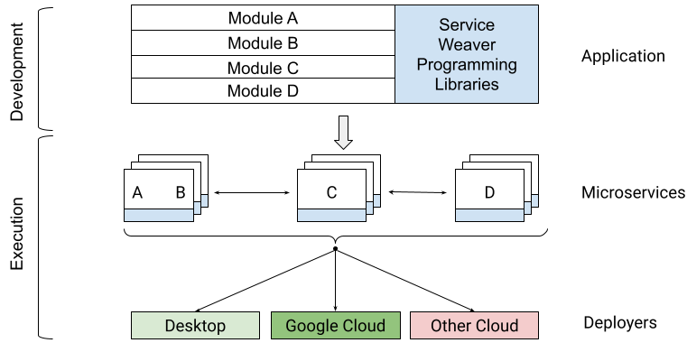
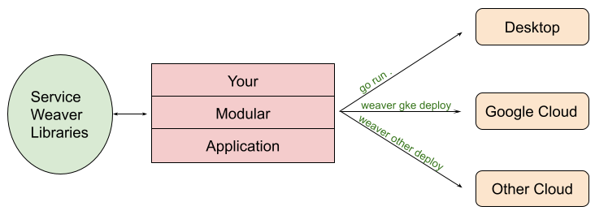

### Introducing Service Weaver: A Framework for Writing Distributed Applications

- 原文地址：[Introducing Service Weaver: A Framework for Writing Distributed Applications | Google Open Source Blog (googleblog.com)](https://opensource.googleblog.com/2023/03/introducing-service-weaver-framework-for-writing-distributed-applications.html)
- 原文作者：Srdjan Petrovic and Garv Sawhney
- 本文永久链接：[w09_Introducing_Service_Weaver_A_Framework_for_Writing_Distributed_Applications](https://github.com/gocn/translator/blob/master/2023/w09_Introducing_Service_Weaver_A_Framework_for_Writing_Distributed_Applications.md)
- 译者：[zxmfke](https://github.com/zxmfke)
- 校对：

We are excited to introduce Service Weaver, **an open source framework for building and deploying distributed applications**. Service Weaver allows you to write your application as a **modular monolith** and deploy it as a set of microservices.

More concretely, Service Weaver consists of two core pieces:

1. A set of programming libraries, which let you write your application as a single **modular** binary, using only native data structures and method calls, and

2. A set of deployers, which let you configure the runtime topology of your application and deploy it as a set of microservices, either locally or on the cloud of your choosing.

   

By decoupling the process of writing the application from runtime considerations such as how the application is split into microservices, what data serialization formats are used, and how services are discovered, Service Weaver aims to improve distributed application development velocity and performance.

### Motivation for Building Service Weaver

While writing microservices-based applications, we found that the overhead of maintaining multiple different microservice binaries—with their own configuration files, network endpoints, and serializable data formats—significantly slowed our development velocity.


More importantly, **microservices severely impacted our ability to make cross-binary changes**. It made us do things like flag-gate new features in each binary, evolve our data formats carefully, and maintain intimate knowledge of our rollout processes. Finally, having a predetermined number of specific microservices effectively froze our APIs; they became so difficult to change that it was easier to squeeze all of our changes into the existing APIs rather than evolve them.


As a result, we wished we had a single monolithic binary to work with. Monolithic binaries are easy to write: they use only language-native types and method calls. They are also easy to update: just edit the source code and re-deploy. They are easy to run locally or in a VM: simply execute the binary.

**Service Weaver, is a framework that has the best of both worlds: the development velocity of a monolith, with the scalability, security, and fault-tolerance of microservices.**

## Service Weaver Overview

The core idea of Service Weaver is its **modular monolith** model. You write a single binary, using only language-native data structures and method calls. You organize your binary as a set of modules, called **components**, which are native types in the programming language. For example, here is a simple application written in Go using Service Weaver. It consists of a main() function and a single Adder component:

```go
type Adder interface { 
    Add(context.Context, int, int) (int, error)
} 
type adder struct{ 
    weaver.Implements[Adder]
}
func (adder) Add(_ context.Context, x, y int) (int, error) {
  return x + y, nil
}

func main() {
  ctx := context.Background()
  root := weaver.Init(ctx)
  adder, err := weaver.Get[Adder](root)
  sum, err := adder.Add(ctx, 1, 2)
}
```

When running the above application, you can make a trivial configuration choice of whether to place the Adder component together with the main() function or to place it separately. When the Adder component is separate, the Service Weaver framework automatically translates the Add call into a cross-machine RPC; otherwise, the Add call remains a local method call.

To make a change to the above application, such as adding an unbounded number of arguments to the Add method, all you have to do is change the signature of Add, change its call-sites, and re-deploy your application. Service Weaver makes sure that the new version of main() communicates only with the new version of Adder, regardless of whether they are co-located or not. This behavior, combined with using language-native data structures and method calls, allows you to focus exclusively on writing your application logic, without worrying about the deployment topology and inter-service communication (e.g., there are no protos, stubs, or RPC channels in the code).

When it is time to run your application, Service Weaver allows you to run it anywhere—on your local desktop environment or on your local rack of machines or in the cloud—without any changes to your application code. This level of portability is achieved by a clear separation of concerns built into the Service Weaver framework. On one end, we have the programming framework, used for application development. On the other end, we have various **deployer** implementations, one per deployment environment.



This separation of concerns allows you to run your application locally in a single process via go run .; or run it on Google Cloud via weaver gke deploy; or enable and run it on other platforms. In all of these cases, you get the same application behavior without the need to modify or re-compile your application.

## What’s in Service Weaver v0.1?

The v0.1 release of Service Weaver includes:

- The [core Go libraries](https://github.com/ServiceWeaver/weaver) used for writing your applications.
- A number of deployers used for running your applications [locally](https://github.com/ServiceWeaver/weaver/tree/main/cmd/weaver) or [on GKE](https://github.com/ServiceWeaver/weaver-gke).
- A [set of APIs](https://github.com/ServiceWeaver/weaver/tree/main/runtime) that allow you to write your own deployers for any other platform.

All of the libraries are released under the Apache 2.0 license. Please be aware that **we are likely to introduce breaking changes** until version v1.0 is released.

## Get Started and Get Involved

While Service Weaver is still in an early development stage, we would like to invite you to use it and share your feedback, thoughts, and contributions.

The easiest way to get started using Service Weaver is to follow the [Step-By-Step instructions](https://serviceweaver.dev/docs.html#step-by-step-tutorial) on our website. If you would like to contribute, please follow our [contributor guidelines](https://github.com/ServiceWeaver/weaver/blob/main/CONTRIBUTING.md). To post a question or contact the team directly, use the Service Weaver [mailing list](https://groups.google.com/g/serviceweaver).

Keep an eye out on the Service Weaver [blog](https://serviceweaver.dev/blog/) for the latest news, updates, and details on future events.

## More Resources

- Visit us at [serviceweaver.dev](https://serviceweaver.dev/) to get the latest information about the project, such as getting started, tutorials, and blog posts.
- Access one of our Service Weaver [repositories](https://github.com/orgs/ServiceWeaver/repositories) on GitHub.

*By Srdjan Petrovic and Garv Sawhney, on behalf of the Service Weaver team*
